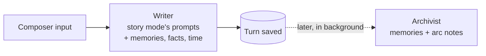

# Bureau — Design Doc

- **Status:** Experimental; phases 1–9 are built
- **Started:** 2026-09-11 (last updated 2026-09-18)
- **Working name:** Bureau (not final)
- **Branch:** built on `feature/bureau` and merged into `main` in PR #51
- **Discussion:** [#49 Chat Mode + Memories](https://github.com/amiantos/writers-guild/discussions/49)

## Summary

Bureau is a new, separate mode in Writers Guild for writing an ongoing story in chapters, with
characters who remember, change, and keep living between chapters. Each Bureau is a self-contained
environment: a cast, a world, an ordered set of chapters, correspondence between chapters, and one
shared clock, **Bureau time**.

A **Writer** produces the prose with story mode's own prompts, and an **Archivist** turns what
happened into memories. A **Director** used to plan each passage first, and an **Editor** used to fix
what style checks flagged; both were removed in September 2026 (see
[Generation pipeline](#generation-pipeline)).

Story mode stays exactly as it is. Bureau imports existing code rather than changing it, and has its
own routes, views, and database file.

## Motivation

In story mode, nothing outlives a story. A story is one text blob, a character card is a fixed
input, and every generation is a single system + user request. Characters start from a blank slate
every time. Returning to a favorite character across many stories starts to feel strange: they never
remember you, never change, and don't exist between stories.

Discussion #49 proposed the missing pieces: a lighter way to talk with characters between stories
("texting while you're busy," as opposed to the "holodeck" of story mode), memory that ties both
together, and time awareness so characters have routines and lives of their own.

Bureau is framed neutrally, in the Writers Guild motif: a tool for living characters and an ongoing
story. Companion-style use (one main character, your persona, frequent correspondence) is one way
to use a Bureau, not a special case. Nearly every companion feature is an ordinary fiction-writing
idea:

| Companion idea            | Writing term                           |
| ------------------------- | -------------------------------------- |
| Memory                    | Continuity                             |
| Growth over time          | Character arc                          |
| Their life between visits | Offscreen time                         |
| Texting                   | Correspondence (epistolary interludes) |
| Profile plus memories     | Series bible                           |

## Goals

- Characters remember what they experienced, per character, with sources you can inspect.
- Characters develop over time through reviewable changes, and their profiles change only when you
  change them, with every version kept.
- Chapters in a Bureau connect: later chapters know what happened in earlier ones.
- Correspondence with cast members between chapters, feeding the same memory.
- One Bureau time, a story clock only you move: messages happen at it, and each chapter starts at
  it or at a time you choose.
- Agentic generation with tools, including a character generator.
- Stricter prose discipline, such as one speaker per paragraph. (Dropped on September 18, 2026, when
  the Writer switched to story mode's prompts.)
- Everything the agents did is inspectable, without cluttering the story.

## Non-goals (for now)

- Changing story mode. It keeps working exactly as it does today.
- Multiple LLM providers. Bureau targets DeepSeek V4.1 Flash only at first.
- Importing or backfilling memories from existing stories. Memory starts empty.
- Vector embeddings. Start with SQLite full-text search.
- Manuscript features such as outlining or export.

## Ground rules

1. **Separate mode.** Bureau code lives in its own namespaced files. Changes to existing files are
   additive and minimal (see [Touch points in existing code](#touch-points-in-existing-code)).
2. **Reuse by import.** Existing services are imported and used as-is, not refactored for Bureau.
   Where Bureau needs a variant of existing logic (for example the preview renderer inside
   `StoryEditor.vue`), it gets its own copy.
3. **Library characters are never modified.** A Bureau keeps its own copy of each card (see
   [Cast members are copies](#cast-members-are-copies)).
4. **Separate database file.** Bureau data lives in `data/bureau.db`, so it can be wiped and rebuilt
   during development without touching `writers-guild.db`.

## Concepts

| Concept              | What it is                                                                                     |
| -------------------- | ---------------------------------------------------------------------------------------------- |
| **Bureau**           | An environment for an ongoing story, written in chapters. Holds everything below.              |
| **Cast**             | The Bureau's characters. Each has a profile (their card and routine), arc notes, and memories. |
| **Interview**        | Questions about one character, written up as a new profile for you to review.                  |
| **World**            | Established facts and attached lorebooks. A timeline and ongoing threads are later.            |
| **Established fact** | Something true in the Bureau's world, such as who lives where, that every agent keeps to.      |
| **Chapter**          | An ordered sequence of turns, with a title, start time, and cast. Chapters are ordered too.    |
| **Turn**             | One group of paragraphs (user prose, a direction, or a generated passage) plus its metadata.   |
| **Turn seam**        | A hidden divider between turns that expands to show how the next turn was made.                |
| **Correspondence**   | A message thread between the persona and one cast member, between chapters.                    |
| **Bureau time**      | The Bureau's current date and time: a story clock that only the reader moves.                  |

Code, the API, and the database still call a chapter a `story`: the `stories` and `story_cast`
tables, routes under `/stories`, and the memory source type `story`.

### Cast members are copies

When a library character joins a Bureau, the Bureau stores its own copy of the card (the **seed
card**). Everything that character develops (memories, arc notes, routine) stays in that Bureau.

- The library card never changes, consistent with Writers Guild's stance that saved characters
  should only change deliberately.
- The Bureau's copy, with the member's routine, is their **profile**. It changes only when you edit it
  or accept an interview, and every version is kept (see
  [Profiles and interviews](#profiles-and-interviews)).
- The same library character can live in two Bureaus with separate histories.
- **Export to library** saves an evolved character as a _new_ library character.

The user's persona is a cast member too. "What a character knows about you" is just one character's
memory of another, so no separate user concept is needed.

### Resetting a Bureau

**Reset Bureau**, in the Bureau's settings, gives a blank slate for trying changes to the cast's
profiles. Almost everything that isn't part of a profile goes: every chapter, message thread, memory
(backstory included), arc note, and fact the Archivist proposed, with the runs of the passages,
replies, Archivist passes, and offscreen accounts that made them. The cast and their profiles, with
every version, stay, and so do interviews, lorebooks, settings, Bureau time, and the facts you
wrote, which set up the world the way lorebooks do.

## The chapter view: turns

Bureau chapters use a reading view modeled on story mode's preview (`showPreview` in
`StoryEditor.vue`): rendered prose with inline images and an input bar at the bottom, instead of one
large textarea.

The trade-off: you lose typing anywhere in the canvas, but a chapter becomes an ordered list of
**turns** instead of one text blob. That enables:

- **Turn seams.** Everything that went into a turn, hidden until you ask for it (see
  [Turn seams](#turn-seams)).
- **Turn actions.** Edit in place, regenerate, delete, and choose between variants.
- **Precise memory sources.** Memories point at the turns they came from.
- **Incremental memory.** The Archivist processes turns since its last pass instead of rereading the
  whole chapter.

### Turn kinds

| Kind                   | Shown as                         | Sent to the Writer as                 |
| ---------------------- | -------------------------------- | ------------------------------------- |
| `prose` (user-written) | Prose, attributed to the persona | Chapter text                          |
| `prose` (generated)    | Prose                            | Chapter text                          |
| `direction`            | A small, collapsible note        | The instruction for the turn after it |
| `scene_break`          | A divider                        | A marker in the chapter text          |

Turns never move Bureau time. Time passing inside a chapter is written as prose, as in any book
("Three hours later…").

### Turn seams

Between every pair of turns is an invisible seam. Hovering reveals a thin divider, and clicking it
expands in place to show how the turn below it was made:

- Which cast member led the turn
- The Writer's reasoning, if thinking was on, and the prompt it was sent
- For turns written before the Editor was removed, style lint flags and each Editor fix, with the
  original text and a revert button
- Model, tokens, and timing for every step
- Later: what the Archivist took from the turn (memories added, arc notes proposed)

Collapsed, a chapter reads like a book. Expanded, it reads like an agent transcript. Everything
stays in one interface, and no separate screen is needed to see how a turn was made.

- **While a turn is generating,** its seam stays visible with a one-line live status ("Writing…").
  Clicking it shows the reasoning as it streams. It collapses when the turn is done.
- **Touch screens have no hover,** so on touch devices seams show as a faint marker you can tap.
- **User-written turns** have seams too, showing only when they were written and whether they've
  been edited.

### Composer

A multi-line textarea at the bottom (story mode's preview bar is a single-line input), with these
actions. Each one sends the prompt of the story mode button that does the same thing (see
[Writer](#writer)):

- **Write:** add the text as a prose turn, then continue the story from it, as typing into a story
  and pressing Continue does. Ctrl or ⌘ + Enter also writes.
- **Direct:** add a direction turn, for example "she suggests the night market," then generate, as
  Continue with Instruction does. In an empty chapter, it's Start Story with the direction added.
- **Continue:** generate with no new input. In an empty chapter, this is story mode's Start Story.
- **Continue for Character,** once the chapter has prose, writes the next part from one character's
  perspective, as story mode's button does. With one character in the chapter it writes for them
  straight away; with more, it opens story mode's character picker. The reader's character isn't
  offered, just as story mode offers only a story's characters. Unlike story mode, every card in the
  chapter stays in the prompt, since everyone is still in the scene. Writing another version writes
  for the same character.
- **Greeting**, while the chapter has no prose yet, offers the greetings on the cards of everyone in
  it (first messages and alternate greetings), with the reader's character as `{{user}}`. As in
  story mode, picking one asks whether to rewrite it:
  - **Rewrite** has the Writer rewrite the greeting in third person, past tense, with story mode's
    rewrite prompt and everything a passage gets: the cast's cards, the world, memories, and the
    chapter's time. The seam shows the greeting, and writing another version rewrites the same
    greeting.
  - **Keep as written** adds the greeting as it is on the card.
- **Scene break** adds a divider without generating, and **Stop** ends a generation early while
  keeping whatever was already written.
- **Time passes** moves the chapter's time forward without generating, with the same choices as
  Time passes elsewhere, and adds a divider showing the new time (see
  [Bureau time](#bureau-time)).

Until September 18, 2026 the Writer had rules of its own for the reader's character: it left what they
said, did, decided, and thought to the reader, and ended a passage when the moment turned to them.
Story mode has no such rule, and Bureau now writes as story mode does, so a line written for the
reader's character gets regenerated or edited by hand.

**Edit chapter**, the pencil in the chapter's header, is story mode's Edit Story: the chapter's title
and its **scenario**, the situation, setting, or premise the chapter follows. It also shows the
chapter's summary, which later chapters are written with, for correcting. The Writer gets the
scenario at the top of every prompt, and the pencil is highlighted while a chapter has one. Each
chapter has its own scenario, starting empty.

Editing a turn opens a textarea for just that turn, which recovers most of the feel of editing
directly.

### Rendering

Bureau ports story mode's preview pipeline into its own composable instead of extracting it from
`StoryEditor.vue`: pull out `` tags, escape HTML, convert markdown images using the shared
patterns in `shared/regex-patterns.js`, split paragraphs, restore images, and sanitize with
DOMPurify. Rendering is per turn, so streaming only re-renders the active turn. A passage being
written shows each image as soon as the Writer finishes its marker (see [Images](#images)).

### Prose stays prose

Turns are storage and UI structure. The Writer still reads the story as continuous prose, never as a
chat transcript. Writers Guild's core bet, that novel-style context produces better writing than chat
formatting, still holds.

### Avatar windows

As in story mode, character portraits can float over a chapter. The picture button in the chapter's
header opens a window (story mode's `FloatingAvatarWindow`) that can be dragged, resized, and
clicked to show someone else. A portrait is the library character's image, so drafts have none.

- The Bureau keeps its windows, not the chapter, so they stay where they were from one chapter to
  the next.
- A window can show anyone in the cast, the chapter's cast first. A new one shows the first
  character in the chapter who isn't the reader's.

## Generation pipeline

A generated turn is written by the Writer and saved as written. The Archivist reads it into memory
later. Both use DeepSeek V4.1 Flash, with different prompts and settings.



**Why split the roles:** Writers Guild exists because chat formatting made models worse
storytellers, and a tool-calling transcript likely does the same to prose. Keeping the Writer's
prompt prose-only keeps streaming simple and lets each role be tuned on its own. It's also why the
Writer has no tools of its own: creating a character mid-passage would put a tool call and its
result in the conversation the prose comes out of.

### Story mode's prompts, and why

On September 18, 2026 the Writer switched to story mode's prompts, because in practice story mode kept
getting picked over Bureau for writing. Every rule Bureau's own prompts gained fixed something
measured in test chapters: a house style, closing rules against drift and repetition, the reader's
character rule, and a style lint with an Editor. Together, though, they made prose that read worse
than story mode's. An experiment that cut each turn down to a single story beat was set aside for the
same reason.

What Bureau adds that story mode can't is continuity: memories, established facts, how characters
have changed, and the chapter's time. That's information, not instructions about how to write, so it
sits on top of story mode's prompt without changing how it writes. The rest of Bureau's interface
stays: turns, seams, variants, directions, and time controls.

### The Director, and why it was removed

Until September 15, 2026 a **Director** planned each passage before the Writer wrote it. It read the
chapter and the composer input, looked things up with tools (`recall`, `lookup_lore`,
`get_character_file`), could add a new character with `create_character`, and handed the Writer a
**scene brief**: beats, tone, a target length, memories to stay consistent with, and continuity
notes. It ran on Write and Direct, and a plain Continue skipped it.

It was removed because the planning made the prose worse and the research turned out to be
redundant:

- **Briefs padded passages.** In 20-passage test chapters, Write passages ran 332 words with a
  two-beat brief against 257 with the Director off, and Direct passages 457 against 370. Capping
  beats at four, then at two, didn't fix it: the Director drafted three to five beats anyway and
  crammed them into long compound ones.
- **The brief's length replaced the Writer's judgment.** It chose "medium" in 11 briefs of 14, which
  told the Writer to write 3 or 4 paragraphs instead of as much as the moment needed.
- **Its research repeated what the Writer already had.** Of the 26 memories its briefs cited across
  every Director run in local use, 2 came from the chapter the Writer reads in full, 2 were a
  character's latest episode (the Writer gets the last three), and the rest were knowledge inside
  the Writer's 4,000-character allowance. Lore it looked up had no field in the brief at all, and
  reached the Writer only if restated in the notes.
- **It was the slowest, costliest step:** 14 to 18 seconds a passage against 3 to 4 without it, and
  more than twice the tokens.

Two things it did needed a home:

- **Leaving the reader's character to the reader.** Without a brief, the Writer carried on the
  reader's character's own action after a Write in 6 passages of 16, against 1 of 16 with one. The
  Writer's instructions now say so for Write directly (see [Writer](#writer)).
- **Creating a character mid-chapter.** The reader does this now, from "Who's in this chapter" (see
  [Character generator](#character-generator)).

**Later, if memory outgrows the prompt:** once a character's knowledge passes the Writer's budget, or
their older episodes start to matter, match memories by keyword over the recent turns, the way
lorebook entries activate. That needs no model call and no wait.

### Writer

The Writer's prompt is story mode's own, built by story mode's `PromptBuilder` from its default
templates, so a chapter is written exactly as a story would be. Tests check that, with nothing
Bureau-only to add, the messages match what story mode sends for the same story.

The system prompt is story mode's default system prompt:

1. The chapter's scenario, when it has one, as story mode's story scenario, with `{{user}}` and
   `{{char}}` filled in as in card text (story mode leaves them as written).
2. The chapter's characters as story mode's character profile (one character) or character
   profiles (two or more). Dialogue examples stay out, as in story mode's presets. Story mode adds a
   lone character's scenario when the story has none of its own, but Bureau always leaves it out: a
   card's scenario is where its story starts, such as a first meeting, and a chapter goes on from
   what the characters remember, and from its own scenario.
3. World information: activated lorebook entries (selected by `LorebookActivator` over the chapter's
   scenario and text, the direction, and a greeting being rewritten), after the setting year when
   there is one.
4. The reader's character as story mode's persona, whose personality is its "Writing Style".
5. Bureau's continuity sections, placed before story mode's instructions:
   - **Established facts,** "true in this story unless the chapter itself shows one changing" (see
     [Established facts](#established-facts)).
   - **Character development:** each character's accepted arc notes ("How Mara has changed").
   - **Earlier chapters:** the summaries of the latest chapters before this one, oldest first, each
     with its title and when it began (five by default, a Bureau setting).
   - **Memories,** with a reminder that a profile or established fact wins when a memory disagrees,
     and that people seldom bring up the past.
   - **Time:** the chapter's exact time, when it began or when time last passed in it (see
     [Time in prompts](#time-in-prompts)).
6. Story mode's instructions and perspective: novel-style prose, third person, past tense, the
   story's language, and no asterisks.

The user message is story mode's too: "Here is the current story so far:" with the chapter's text,
then the template for the action:

| Bureau action          | Story mode template                           |
| ---------------------- | --------------------------------------------- |
| Continue, Write        | `continue`, "Continue the story naturally..." |
| Continue (empty)       | `storyStarter`, as Start Story                |
| Direct                 | `instruction`, as Continue with Instruction   |
| Direct (empty)         | `storyStarter`, with the direction's sentence |
| Continue for Character | `character`, "from {{char}}'s perspective"    |
| Greeting's Rewrite     | `rewriteThirdPerson`, on the greeting alone   |

The chapter's text leaves out directions, and oldest turns are dropped first if it outgrows the
context. The budget is worked out as story mode's is, for DeepSeek V4.1 Flash's 1M-token context:
what's left once the system prompt and the Writer's max tokens are reserved, at about three
characters a token.

The Writer starts with thinking off, temperature 0.5, and 8,000 tokens, the DeepSeek preset story
mode was being written with when Bureau switched to its prompts. (The DeepSeek preset story mode
creates starts at temperature 1.0, 4,000 tokens, and a 128k context.) Message replies use the same
temperature. Bureaus that saved their settings before keep what
they saved.

Output streams into the active turn and is saved as written. Images pass through `ImagePreserver` as
in story mode (see [Images](#images)).

**Before September 18, 2026** the Writer had its own prompt: an editable house style, a closing list
of rules for long chapters (write only as much as the moment needs, pick up where the last passage
stopped, no repeated gestures or lines, end on what someone does or says), and the reader's
character rule. In 20-passage test chapters those rules cut late passages from about 700 words to
440 and sentences from 22.8 words to 15.8. The house style is still stored in `bureau.db`, unused.

### Images

Cards, lorebooks, and chapters can carry images, as markdown or `` tags, just as in story
mode. A greeting might open with a picture, or a lorebook entry might hold pictures for the Writer
to show when something happens.

- The Writer sees each image as a `[WG_IMAGE_n]` marker from `ImagePreserver`, and a marker it
  writes comes back as that image. While a passage streams, each marker shows as its image as soon
  as it's complete. A rewritten greeting keeps its images: any the Writer leaves out go at the end,
  as in story mode's rewrite.
- The other roles only read images. The Archivist, replies, offscreen life, interviews, and the
  character generator get each one as a short label from its alt text, such as
  `[image: the harbor at dawn]`. A cached asset URL is long and no use to a model, and it would
  crowd out the words around it, as in a lorebook entry a prompt carries.
- Messages don't show images, so a reply can't send one.

### Style lint and Editor, and why they were removed

Until September 18, 2026, pure code checks (`style-lint.js`) ran on every generated passage: two
characters speaking in one paragraph, first-person narration when the house style asked for third
person, narration repeated from recent turns, and banned phrases. The **Editor** then had the Writer
revise the flagged paragraphs in its own conversation, with a forced `edit_paragraphs` call, and the
seam showed each fix with a revert button.

They went with the move to story mode's prompts. Story mode saves what the model writes, and the
Editor's rewrites were part of what made Bureau's prose read differently. Seams of turns written
before then still show the lint flags and fixes, and a fix can still be reverted.

### Archivist

**When it runs:** on demand ("Commit to memory"), when a chapter ends, and in the background once
turns have settled. A turn is settled when six newer turns follow it; after each generated turn, a
pass starts if at least six settled prose turns are waiting. A Bureau can turn automatic archiving
off, and then the Archivist runs only on demand. Threads are read the same way, one session of
messages at a time: in the background once a session is over (checked after each reply and each
time you let time pass), from "Commit to memory" in the thread, and for a chapter's cast before the
chapter starts.

**Input:** the turns it hasn't read, in passes of about 60,000 characters; the chapter's running
summary; who was present, with each one's whole profile (description and personality); what each
present character already knows, as numbered memories; and the established facts it can see,
numbered, with the proposals waiting and the facts the reader turned down. A chapter pass sees the
chapter's own accepted facts too, and a pass over messages sees the facts as of the session's last
message. Direction turns and memories held for review are left out.

**Output:** one forced call to a strict `record_memories` tool, with thinking off:

- `knowledge`: what later chapters and messages will need, per character, each with an importance,
  the passages it came from, the number of any memory it `supersedes`, and a `conflict`: what in a
  profile or established fact it disagrees with, or nothing
- `arc_notes`: changes to who a character is, for the reader to review (see
  [Character development](#character-development))
- `facts`: new established facts, or changes to one, for the reader to review: each the whole fact
  as it now stands, the number of the fact it replaces (or 0), a rationale, and the passages (see
  [Established facts](#established-facts))
- `story_summary`: the whole chapter so far, in at most 250 words: who was there, what happened,
  and how things were left. It's shown in the Bureau's chapter list, and later chapters are written
  with it (see [Writer](#writer)).

**What knowledge is for.** Since September 18, 2026, what happened lives in the chapter's summary,
and knowledge keeps only what later chapters and messages will need, so nothing left open gets
dropped: promises, plans, and arrangements that reach past the chapter; matters left open, such as
a question not yet answered or a secret being kept; turning points between people; and lasting
things learned about someone for the first time. Each one has to pass a test: would a later chapter
get something wrong, or drop a thread, without it? What happened in the scene, who said what,
gestures, meals, clothes, and scenery are left to the summary. A pass usually records none to three
per character. When a later chapter resolves one, such as a promise kept or a plan dropped, the
Archivist supersedes it with how it stands now. Messages leave no summary, and later chapters don't
read them, so for messages knowledge also keeps the news shared and decisions made that a later
chapter should know about.

Before then, the Archivist also wrote an **episode** per character: what happened in the chapter or
exchange of messages from their point of view, in at most 120 words. Knowledge covered much more,
about one memory per 1,000 to 2,000 characters of prose, most of them rated 3 or 4 in importance, so
the Writer's 4,000-character budget filled up with scene details after a chapter or two. Existing
episodes stay in the memory browser, but prompts no longer use them.

The Archivist is told the profiles and established facts are true. It records what passages say
outright, not what they only seem to suggest: someone heading home, or writing from somewhere else,
says nothing new about where anyone lives. It skips what a profile already says. A knowledge item
with a `conflict` is held: it's saved with what it disagrees with and marked for review, and stays
out of every prompt until the reader keeps, edits, or retires it (see
[Sources and review](#sources-and-review)). A memory it would replace stays current meanwhile, and a
warning says which: keeping or editing the held memory replaces that memory, and retiring the held
memory leaves it as it was. A pass
reports how many memories it added, held, and updated, and how many facts it proposed, and the
notice after committing to memory says so, such as "1 held for you to check, 2 facts proposed".

A new session starts when Bureau time moves on more than three hours or goes back between two
messages, or when a chapter was started between them. The last session is over once a message sent
now would start a new one. A thread's memories are dated to the start of their session and cite its
messages. The reader's side of
a session is whoever sent its messages, even if the reader has picked another character since.

Memory operations apply automatically because they are visible, sourced, and reversible; only held
memories wait for the reader. The Archivist can supersede memories but can't retire or delete them,
and it leaves alone pinned memories and any you change while it's reading. Changing a turn it has
read (editing, deleting, switching versions, or regenerating) marks the memories, arc notes, and
facts that cite the turn for review, and the chapter's summary too when it covers the turn. **Edit
chapter** shows the summary for correcting, with a note while it's marked, and the chapter list
flags it; saving the summary clears the mark.
Editing or deleting a message does the same for what cites the message. A turn that changes while a
pass is reading it is flagged the same way. Deleting a chapter, from the Bureau's chapter list,
deletes its memories, arc notes, and facts, which brings back any memories and facts they had
replaced.

**Later:** the rest of world state: ongoing threads and timeline events. Established facts are the
part built so far.

### API key and model

Bureaus share one DeepSeek API key, stored in `bureau.db`. It's set with **Shared API key** on the
Bureaus tab, or by sharing the key typed into a new Bureau when none is saved yet. A Bureau can have
its own key instead, set in its settings, which also keeps its billing separate. Each Bureau has its
own model. Bureau never reads story mode's presets. The UI shows keys masked, and the API never
returns a stored key in full.

### DeepSeek client

Bureau gets its own `deepseek-client.js`; the existing `deepseek-provider.js` stays untouched. It
handles multi-turn `messages`, `tools`, a thinking toggle, and streaming that assembles tool-call
deltas. `tool-loop.js` runs tool calls on top of it, and `run-recorder.js` stores every step.

API details it relies on (checked against api-docs.deepseek.com on 2026-09-12):

- V4.1 Flash's model ID is `deepseek-flash`, the default model for new Bureaus.
- Thinking is on unless a request turns it off, so the client always sends `thinking` explicitly.
  `reasoning_effort` (`low`, `high`, or `max`) is a top-level field.
- Thinking mode rejects `tool_choice: "required"` and named tool choices.
- When a request includes tools, every earlier assistant message must keep its
  `reasoning_content`, even turns without tool calls, or the API returns 400.
- Strict function schemas require the `/beta` base URL, `strict: true` on every function, every
  object property marked required, and `additionalProperties: false`. The client checks schemas
  before sending them.
- JSON output mode (`response_format: { type: 'json_object' }`) is available as a fallback.
- Streams can include `: keep-alive` comment lines, which the parser skips.

## Memory

Memory belongs to characters, not to the Bureau.

| Layer          | Contents                                                                                  | In the prompt                                            |
| -------------- | ----------------------------------------------------------------------------------------- | -------------------------------------------------------- |
| Profile        | The Bureau's copy of the card, and the routine; changes only by hand or from an interview | Always                                                   |
| Arc notes      | Accepted development notes, versioned                                                     | Always                                                   |
| Knowledge      | What later chapters need: promises, plans, open matters, turning points, people learned   | Always, within a budget ranked by importance and recency |
| Chapter recaps | Each chapter's summary, not a memory but read as one: the chapters the character was in   | The latest five                                          |
| Eras           | Later: summaries rolled up from older chapter summaries                                   | Always, compact                                          |
| Offscreen life | Routine, plus what the character did while nobody was watching                            | The latest account, until a chapter they're in follows   |
| Archive        | Raw turns and messages the character witnessed                                            | Only through `recall`                                    |

### Who remembers what

Start simple: cast members in a chapter remember it, and correspondence is private to its two
participants. Offscreen life belongs to the character who lived it until they share it. Presence is
tracked per chapter at first; per-turn presence (someone leaving mid-scene) can come later.

The reader's character remembers like everyone else: the Archivist records what the passages show
them saying, doing, or learning, and the Writer sees it. They differ only in being the character the
reader writes as.

Phase 3 built seed cards, knowledge, and episodes. In the Writer prompt, each character gets their
pinned knowledge, then the most important knowledge that fits a budget (4,000 characters by default).
Instead of per-character episodes, the Writer gets the summaries of the latest earlier chapters (five
by default); replies, offscreen accounts, and interviews get the latest ones the character was in.
Both limits are Bureau settings. Replies, offscreen accounts, and interviews are told the character
knows only what happened while they were there, since a summary tells the whole chapter.

A chapter also only remembers what happened before its start time (see
[Time and memory](#time-and-memory)).

### Sources and review

Every memory links to the turns or messages it came from. Each character has a memory browser:
search, edit, pin, retire, and jump to the source. A wrong memory breaks the illusion faster than no
memory, so memories must be visible and easy to correct. Retired memories, and memories replaced by
newer versions, stay in the browser and can be restored. Restoring a replaced memory retires the
newest version that replaced it, so only one version is current.

A memory the Archivist found disagreeing with a character's profile or an established fact is
**held**. The browser marks it "Disagrees with a profile or fact" and says what it disagrees with.
No prompt uses it, and `recall` can't find it, until you keep it ("It's right: use it"), edit it, or
retire it, and it counts among the character's memories waiting for review. A held memory that
updates another replaces it only once you keep or edit it; retiring the held memory leaves the other
as it was. Memories that contradict the
cards used to go straight into every later prompt, where a short, confident memory could outweigh a
sentence deep in a card.

### Retrieval

SQLite FTS5, which is available in the app's better-sqlite3 build, indexes memories and the archive.
Always-on layers cover most needs; the long tail waits for keyword-matched recall in the Writer's
prompt (see [Generation pipeline](#generation-pipeline)). Embeddings are a
later option if full-text search misses too much (paraphrases, for example). Nothing depends on a
DeepSeek embeddings endpoint; we couldn't confirm one exists.

### Backstory

A character's memory browser also takes backstory: what they already know or share with other cast
members. It's saved as knowledge with no chapter and no time, so every chapter can see it.

## Established facts

An established fact is something true in the Bureau's world that every agent keeps to: who lives
where and with whom, someone's work, a relationship, a place. Facts are the part of world state
built so far; a timeline and ongoing threads are later.

### Why facts

A fact like "Mara and Theo live together" used to live only in places where it could slip:

- **Deep in card descriptions.** A sentence two thousand characters into a card is easy to miss, and
  some roles saw only the start of a card.
- **In each character's memories.** Every character keeps their own copy, so the copies can drift
  apart, and a message that only seemed to say otherwise could become a memory that outweighed the
  card.

A fact is one shared line instead of a copy per character, in a short section every role reads, and
it can change over time (they move) without anyone editing a card. Facts are always in the prompt,
never activated by keywords the way lorebook entries are: a scene about getting home may never use
the word an entry would key on, and a short list costs little.

### Writing and proposing facts

- **Where:** the World section of the Bureau page, above Lorebooks. Proposals come first, newest
  first, then the facts that stand. Facts that were replaced or rejected wait behind a toggle.
- **You write facts** in the add box, and they're accepted as written. You can edit or delete them.
- **The Archivist proposes facts** in its usual pass, only when passages clearly establish something
  lasting that the facts don't cover, or clearly change one of them. A change names the fact it
  replaces and states the whole fact as it now stands. It never repeats an established fact, one
  waiting for review, or one you turned down, and a change to a fact it can't see is proposed as a
  new fact, with a warning.
- **You review each proposal:** accept, edit then accept, or reject. A fact accepted from a chapter
  or messages can be undone by rejecting it, and every fact can be deleted.
- **A change doesn't edit the old fact.** The old fact stays, marked as replaced by a later one. A
  chapter set before the change still sees it, and rejecting or deleting the change brings it back.
- **Facts that replace one another form a line,** and the latest accepted fact in a line stands for
  it: latest by Bureau time, then by when it was accepted. Rejecting or deleting a change from the
  middle of a line, or accepting two changes to the same fact, still leaves one fact standing, and
  a deleted fact's later changes name what it replaced instead. Deleting the fact a line began with
  makes its first change the start of the line, so two changes to it still make one line.

### Facts in prompts

Every role gets the established facts, and every role is told that a profile or fact wins when a
memory disagrees:

- **Writer:** an established facts section after the cast, the world, and the reader's character,
  and before memories, "true in this story unless the chapter itself shows one changing"
- **Replies and offscreen accounts:** the facts as of Bureau time, or the new time
- **Archivist:** numbered, with the proposals waiting and the facts you turned down

`{{user}}` in a fact becomes the reader's character.

Which facts a prompt sees follows the timeline rule for arc notes. Facts you wrote always count. A
chapter sees accepted facts from before its start, and replies and offscreen accounts see the ones
dated up to their moment. A chapter's own facts reach only the Archivist, since the chapter's text is
already in the Writer's prompt. Of the facts a prompt can see in a line of changes, only the latest
accepted one stands.

A memory that disagrees with an established fact is held, like one that disagrees with a profile
(see [Sources and review](#sources-and-review)).

### Sources

- Facts from a chapter link to the passage they came from.
- Editing, deleting, regenerating, or switching versions of a turn, or editing or deleting a
  message, marks the facts that cite it for review.
- Deleting a chapter deletes its facts, and the facts they replaced stand again.
- Reset Bureau deletes the facts the Archivist proposed and keeps the ones you wrote.

## Character development

- Accepted arc notes layer on top of a character's profile. Nothing automatic rewrites the profile:
  only you do, by hand or by accepting an interview (see
  [Profiles and interviews](#profiles-and-interviews)).
- The Archivist proposes arc notes during its usual pass, with a rationale and the passages that show
  the change, and only when a chapter changes who a character is: a new habit, a stance that
  softened or hardened, a lasting decision. It skips changes the character already has, that are
  already waiting, or that you rejected. Proposals never apply on their own.
- You accept, edit then accept, or reject each one in the character's memory browser ("How they've
  changed"), and can write one yourself, which is accepted as written. Rejected notes stay as
  history, and an accepted note that was edited shows what was first proposed.
- Accepted notes follow the same timeline rule as memories: a chapter sees notes from before its
  start. The Writer gets them in a character development section ("How Mara has changed"). Changing a
  passage a note cites marks the note for review.
- **Why the Archivist doesn't rewrite the profile:** repeated LLM rewrites flatten a character toward
  bland and agreeable. A profile that only you change anchors the voice; notes only add.
- **Drift check (later):** periodically compare recent dialogue against the profile's voice and flag
  drift.
- **Export to library** copies the profile's card into a new library character, adds the accepted
  notes to its description under "How {name} has changed", keeps the original's portrait, and tags
  it `bureau`. The library character the Bureau copied is never overwritten.

## Profiles and interviews

A cast member's **profile** is the Bureau's copy of their card, plus their routine: where you read and
change who a character is, one character at a time.

### Profile

- **Where:** the Profile button on each cast row, a profile button beside each name in "Who's in this
  chapter", and one in a message thread's header.
- **What it holds:** description, personality, routine, scenario, first message, and example
  dialogue, each editable by hand. Name, portrait, and greetings stay as they joined. Accepted arc
  notes show below, read-only.
- **History:** every change is kept as a version, labeled edited by you, from an interview, or
  restored. The first change also keeps the profile as it was. Restoring a version saves it as a new
  version, so nothing is lost.
- The routine used to have its own button on the cast row. It lives in the profile now, since
  replies and offscreen life depend on it and interviews can fill it in.
- The library character is never touched. Export to library carries the profile's card as it
  stands; the routine stays in the Bureau, since a library card has no place for it.

### Interview

An interview asks you about one character a question at a time, then writes your answers up as a new
profile for you to review. It's the familiar character interview exercise, and it keeps the new
material yours: the model asks and writes up, but the facts come from your answers.

- **Focus:** Flesh them out (history, wants, habits, days, and where they stand with the cast),
  Relationships, or Daily routine, with an optional note on anything in particular.
- **The interviewer** gets the profile, how the character has changed, what they remember as of Bureau
  time, the rest of the cast, and the world. It asks about one thing at a time: what the profile
  leaves thin, unsaid, or in tension, never what's already settled. **Skip** moves on for good,
  **You decide** has it choose something that fits and say what it chose, and **Ask something else**
  replaces the latest question. Questions stream with thinking off, each recorded as a run.
- **Write it up** makes one forced `write_profile` call with thinking off. It returns the whole
  description, personality, and routine in plain English, a line on what changed, and lines for
  other cast members' descriptions when the interview revealed a relationship their descriptions
  don't cover, since they may appear in scenes without this character. It changes only what the
  interview changed, keeps the rest in its own wording, and adds nothing the author didn't say.
  Placeholders like `{{user}}` stay as written, since the reader's character can change.
  Images in the profile come back where they were, or at the end of their field if the model drops
  their markers.
- **Review:** edit any field, keep or drop each relationship line, then accept. Nothing changes
  until you do. Accepting saves a version from the interview on every profile it changes, with
  relationship lines at the end of the other character's description. If the profile changed after
  the write-up, accepting is refused until you write it up again.
- A character has one open interview at a time, which keeps its questions and answers until you
  accept or discard it. Answering again sets a waiting write-up aside.
- Interviews rewrite description, personality, and routine only. Editing several characters in one
  interview was left out as too complicated; relationships reach the other character through the
  write-up instead.
- First trials against V4.1 Flash showed write-ups embellishing: traits and atmosphere nobody gave,
  and answers invented for skipped questions. The write-up now keeps untouched text as it was and
  adds only what the author said.

## Correspondence

- One thread per cast member, written with the Bureau's reader's character, so choosing a reader's
  character in the cast is what opens messages.
- Replies are short first-person messages, texts by default. The Bureau's settings have a **message
  style** for how they read; for a Bureau set before phones, it can describe letters or telegrams.
- Messages happen at Bureau time: each message and reply is dated at the Bureau's current time, and
  none of them move it (see [Bureau time](#bureau-time)). To let time pass between messages, use
  **Time passes** in the thread's header. Each message keeps the Bureau time it was sent at.
- A reply is one streamed call with the character's profile and arc notes, the reader's character's
  profile, the established facts and the character's memories as they stand at Bureau time (a
  chapter that started earlier counts even if it hasn't ended), lore activated by recent messages,
  and the conversation as a labeled transcript, since this is a chat.
  Writing to each other doesn't mean the two of them live apart, or even that they're apart right
  now, and the prompt says so: where each of them lives and is comes from their profiles, the facts,
  and the conversation. A profile or fact wins when a memory disagrees.
  The transcript marks the exact time at its start and after each long gap. The prompt ends with the
  exact Bureau time, and how long it's been since the last message when that matters. Messages in a
  reply are separated by a line holding only `---`, and a reply saves as up to six messages.
- The thread view groups messages into sessions (no gap over three hours), shows how each reply was
  written in a seam, and lets you edit or delete any message; changing one marks memories that cite
  it for review. "Let them write" asks for messages without a new one from you.
- Sessions go into memory the way chapters do (see [Archivist](#archivist)), so the next chapter
  knows you texted that afternoon. Each cast member has a **routine**, written in their profile (see
  [Profiles and interviews](#profiles-and-interviews)), which replies take into account for the time
  of day.
- After a quiet stretch, a reply first gets the character an account of what they did meanwhile (see
  [Offscreen life](#offscreen-life)); the reply's seam shows it as part of the run.
- **Later:** replies that can look things up, characters message first, and other delivery
  channels such as an IRC bridge.

## Bureau time

Each Bureau has a single clock, **Bureau time**: the current date and time in the Bureau. It's a
story clock. It never follows your real clock, and only you move it:

| What moves it            | What happens to Bureau time                                                                                               |
| ------------------------ | ------------------------------------------------------------------------------------------------------------------------- |
| Time passes              | It moves forward: an hour later, later that day, the next morning, a few days later, a week later, or to a time you pick. |
| Settings                 | It's set to any date and time, earlier or later.                                                                          |
| A chapter starts         | You choose: the current Bureau time or a time you pick. The chapter keeps it as its start time.                           |
| A chapter ends           | You choose: leave it as it is, or a time you pick to reflect how long the chapter lasted.                                 |
| Time passes in a chapter | It moves on from the chapter's time in the same ways, and the chapter marks where.                                        |

Messages, replies, and passages never move Bureau time. Both chapter dialogs default to whatever you
chose last time.

### Setting the date

- **Time passes** sits in the message thread's header and next to Bureau time in the Bureau's
  Chapters section. The next morning is 8:00 on the following day, and days count on the Bureau's
  clock in its time zone (the server's until one is saved), so a daylight saving change doesn't
  move the hour. A picked time must be later than Bureau time. Like a reply, Time passes commits
  the exchanges of messages it leaves finished to memory, in the background.
- **Time passes in a chapter** sits in the composer, next to Scene break. It moves on from the
  chapter's time (when time last passed in it, or its start) and must end up later. It adds a
  `time_passes` turn, shown as a divider with the new time, and Bureau time moves up to it. If
  Bureau time is already later (say, after letting time pass between messages), it stays put, so
  it never goes back behind messages already sent. It writes no offscreen accounts, since the
  chapter covers that time. The divider can't be edited, and deleting it leaves Bureau time where
  it is. Memories from the chapter are still dated to its start.
- The Bureau's settings edit Bureau time directly, earlier or later. Going back happens there.
- The date and time fields (in settings, Time passes, and the chapter dialogs) show and read times
  on the Bureau's clock, in its time zone (this browser's until one is saved), matching the times
  shown beside them.
- Any year from 1 to 9999 works, so a Bureau can be set in 1350 or 1996.
- When a moment falls in a year other than the real one, the year goes into the world section of
  prompts as setting ("The year is 1350."), not as a timestamp, so the Writer avoids anachronisms.
- Correspondence doesn't have to be texting. The message style can set a medium that fits the era,
  such as letters.
- Bureau time used to follow the real clock, shifted by a whole-day offset. Migration 7 moved each
  shifted Bureau's clock to the date it showed then, and the offset no longer counts.

### Time in prompts

Prompts give the exact time, such as "12:10 AM on Monday, September 13, 2027". Prompts used to give
only a loose time ("a Tuesday, a little past midnight, late October") so models wouldn't fixate on
the clock, but that didn't keep the clock out of the prose: told only that it was a little past
midnight, a character would name a precise time that disagreed with Bureau time. Now that only the
reader moves the clock, the time is deliberate, so the prompts say it exactly:

- The Writer gets the chapter's time with every passage: "This chapter begins at
  exactly ..." for the opening, then "When the chapter began, the time was exactly ...", or, once
  time has passed in the chapter, when it last passed. Right after time passes, they pick the story
  up at the new time.
- The Writer lets the time shape the scene without dwelling on the clock, and keeps any mention of
  the time consistent with it and with how much has happened since.
- In the chapter text the Writer and Archivist read, time passing is a scene break
  followed by "[Time passes. It's now exactly ...]". An Archivist pass only reads its own
  passages, so one that starts after time has passed is also told when it last passed.
- **Correspondence** gets the exact time at the start of the transcript, after each long gap, and
  at the end. The gaps themselves stay loose ("about a day since the last message"), as do
  offscreen accounts' spans.
- Descriptions come from small, unit-tested functions in `bureau-time.js`, not from the model, so
  they stay consistent.

### Time and memory

- **A chapter only remembers what happened before its start time.** Messages exchanged while a
  chapter is still unfinished don't leak into it, because they come after its start. Starting a
  chapter at an earlier time works as a flashback: characters don't know what happens later.
- Memories from a chapter are dated to its start time. Memories from correspondence are dated to the
  start of the session they came from. Facts from a chapter are dated to where the chapter stood in
  time at the latest passage they cite, so a change after time passes in a chapter doesn't reach
  back to its start.
- At the same Bureau time, what was written first comes first. Messages don't move the clock, so a
  conversation often shares its time with the next chapter: messages written before the chapter
  started count as before it, and messages written after it don't leak in. Starting a chapter also
  ends the session of messages before it. When two chapters start at the same time (say, one ended
  without moving the clock and the next started at Bureau time), the one earlier in the Bureau's
  order comes first. Prompts list memories that share a time in the same order, so a conversation
  after a chapter reads as coming after it.
- A chapter sees each memory as it stood when the chapter starts. A memory replaced by a later
  chapter still counts in a flashback set before the change.
- A chapter's own memories stay out of its Writer prompt, because its text is already there.

### Offscreen life

- A character is owed an account when at least 12 hours of Bureau time have passed since they were
  last seen: their latest dated memory, their latest message, or the end of a chapter they were in.
  Anyone in a chapter that's still going is left alone, since the chapter is their time. One forced
  call to a strict `record_offscreen` tool writes everyone owed one two to four sentences about how
  they spent the gap, saved as an offscreen memory:
  - Before a chapter starts: its cast, after their unread messages are committed to memory (a
    thread that fails doesn't keep the others out). Accounts are dated just before the chapter's
    start, and if either step fails, the chapter still starts, with a notice.
  - Before a reply: that character, with the account dated just before the current session of
    messages began. A failure there doesn't stop the reply.
- The call sees each character's whole description and personality, their routine, what they know,
  the summaries of the last two chapters they were in, how they have changed, and their last time away, with the established facts as of
  the new time. It keeps to the profiles and facts: where someone lives, who they live with, and
  their work don't change offscreen. The reader's character gets accounts too, and like any memory,
  an account can be edited or retired.
- Moving time forward when a chapter **ends** doesn't generate offscreen life. That span counts as
  time the chapter covered.
- Time passes doesn't write accounts by itself, and time passing in a chapter never does, since the
  chapter covers that time. Accounts are written when they're needed: before the next reply or
  chapter start.
- Nothing runs in the background: a month away produces one summary, not thirty days of invented
  drama. Prompts ask for mostly mundane events and cap the notable ones.
- The Writer and reply prompts include the latest account ("Mara lately: ..."), until a chapter
  they're in begins after it. The memory browser lists accounts under "What happened", and a Bureau setting
  turns offscreen life off.

## Character generator

One service, two ways in. Both make one forced strict tool call with thinking off, recorded as a run.
The generator sees the Bureau's cast (names and short descriptions) and world (attached lorebooks and
a few entry titles), so a new character fits in without repeating anyone. The card is about the new
character alone: it never names or describes anyone already in the cast, and leaves how they meet
to the chapters.

- **From a Bureau:** "Generate character" in the cast section takes a seed idea and produces a full
  V2 card (name, description, personality, scenario, first message, example dialogue, tags) and a
  structured **appearance block**. You review and edit it, then add it to the cast as a draft, or add
  it and save it to the library at once. A name can be given up front, so the card comes back as the
  character you had in mind.
- **From a chapter:** "Who's in this chapter" adds someone to the cast without leaving the chapter,
  from the library or from the generator, and ticks them into the chapter ready to save. Generating
  there also takes their part in the chapter, which the generator writes the card around. Until
  September 15, 2026 the Director created characters mid-passage instead (see
  [The Director, and why it was removed](#the-director-and-why-it-was-removed)).
- **Drafts** exist only in their Bureau, so new characters stay consistent without cluttering the
  library. The Writer and Archivist treat them like anyone else. "Save to library" on a
  draft's cast row saves its card as a new library character (without an image) and links the cast
  member to it.
- **Appearance block:** hair, eyes, build, age range, clothing style, and distinguishing marks,
  stored under the card's `extensions.bureau_appearance`. It gives portrait generation a stable
  description to work from.
- **From the library (later):** the same generator without a Bureau's world, saving straight to the
  library.
- **Portraits (later):** a pluggable image provider (AI Horde's image API, a local
  ComfyUI/Automatic1111, or a hosted API). Images are stored with `AssetManager` under a `bureaus`
  entity type, served by a Bureau route, and can appear inline in turns.

## Run records

- Every pipeline run and step is recorded: role, messages, tool calls and results, raw output,
  reasoning, tokens, timing, and errors.
- [Turn seams](#turn-seams) are the main way to read a run, right next to the prose it produced.
- **Later, a Workbench screen:** compare runs side by side and rerun a step with an edited prompt.

## Data model

`data/bureau.db` uses better-sqlite3 in WAL mode, with its own schema versioning. References to rows
in `writers-guild.db` (library characters and lorebooks) are plain ids, not foreign keys.

A sketch, not final. Phase 1 created `bureaus`, `cast_members`, `agent_runs`, and `agent_steps`;
later phases add the rest as migrations:

```text
bureaus        (id, name, description, api_key, model, bureau_time, present_offset_days [unused],
                timezone, house_style, settings JSON, avatar_windows JSON, created, modified)
shared_settings (id [always 1], api_key [used by Bureaus without their own])
cast_members   (id, bureau_id, library_character_id NULL, name, is_persona, is_draft,
                seed_card JSON [the profile's card], routine JSON, created, modified)
profile_versions (id, bureau_id, cast_member_id, fields JSON,
                source [original|manual|interview|restore], source_id NULL, created)
interviews     (id, bureau_id, cast_member_id, focus, note, status [open|accepted],
                messages JSON, proposal JSON NULL, created, modified)
arc_notes      (id, bureau_id, cast_member_id, content, proposed_content, rationale,
                status [proposed|accepted|rejected], world_time NULL,
                source_type [story|correspondence|manual],
                source_id NULL, source_turn_ids JSON, run_id NULL, needs_review, created,
                decided NULL, modified)
bureau_lorebooks (bureau_id, lorebook_id)
facts          (id, bureau_id, content, proposed_content, rationale,
                status [proposed|accepted|rejected], replaces NULL [the fact it changes],
                world_time NULL, source_type [story|correspondence|manual], source_id NULL,
                source_turn_ids JSON, run_id NULL, needs_review, created, decided NULL, modified)
world_threads  [later] (id, bureau_id, title, summary, status, modified)

stories        (id, bureau_id, position, title, scenario, status [active|ended], start_time,
                end_time NULL, archived_through, summary, summary_needs_review, created, modified)
story_cast     (story_id, cast_member_id)
turns          (id, story_id, position, kind, source [user|generated], author_cast_id NULL,
                content, run_id NULL, edited, created, modified)
turn_variants  (id, turn_id, content, run_id, created)

threads        (id, bureau_id, cast_member_id, archived_through, created, modified)
messages       (id, thread_id, position, source [user|generated], sender_cast_id NULL, content,
                bureau_time, run_id NULL, edited, created, modified)

memories       (id, bureau_id, cast_member_id, layer [knowledge|episode|era|offscreen],
                content, importance, world_time NULL,
                source_type [story|correspondence|offscreen|manual],
                source_id NULL, source_turn_ids JSON, run_id NULL, superseded_by NULL,
                pinned, retired, needs_review,
                conflict [what it disagrees with in a profile or fact; '' when nothing],
                created, modified)
memories_fts   -- FTS5 over memories.content
archive_fts    -- FTS5 over turn and message text

agent_runs     (id, bureau_id, purpose, target_type, target_id,
                status [running|completed|failed|cancelled], error, started, finished)
agent_steps    (id, run_id, position, role, kind [model|tool], request JSON, response JSON,
                reasoning, tool_calls JSON, usage JSON, duration_ms, error, created)
```

Messages store their Bureau time directly instead of deriving it from `created`, because Bureau time
has nothing to do with the real clock.

## Code layout

New code follows the existing layout, namespaced under `bureau`:

```text
server/src/routes/bureaus.js             # /api/bureaus/*
server/src/services/bureau/
  bureau-db.js                           # bureau.db connection and schema
  bureau-storage.js                      # queries
  deepseek-client.js                     # messages, tools, strict schemas, streaming
  tool-loop.js                           # runs tool calls until the model answers
  writer-turn.js                         # the Writer's turn, one run per turn
  writer-prompt.js                       # story mode's prompts, plus memories, facts, and time
  archivist.js
  memory-storage.js                      # memory queries and FTS
  memory.js                              # what a story or moment can see (memories, notes, facts)
  fact-storage.js                        # established facts
  profile-text.js                        # whole profiles, and facts, as prompts read them
  bureau-time.js                         # Bureau time changes, exact time descriptions
  thread-storage.js                      # correspondence threads and messages
  correspondence.js                      # replies
  offscreen.js                           # what characters did while time jumped forward
  character-generator.js
  greetings.js                           # card greetings a chapter can open with
  images.js                              # image labels, and images shown as a passage streams
  interview.js                           # interview questions, write-ups, and accepting them
  interview-storage.js                   # interviews with their questions and answers
  run-recorder.js                        # agent_runs and agent_steps
server/src/routes/bureau-profiles.js     # profiles and interviews
server/src/routes/bureau-facts.js        # established facts
server/scripts/bureau-smoke.js           # tool-loop smoke test against the real API

vue_client/src/views/bureau/             # Bureau list and home, story, correspondence, interview
vue_client/src/components/bureau/        # TurnBlock, TurnSeam, Composer, MemoryBrowser, BureauFacts, ...
vue_client/src/composables/bureau/       # turn rendering, streaming, avatar windows, ...
```

Tests are colocated in `__tests__/` as usual. Bureau database tests create temporary directories and
never touch `data/`.

### Reused as-is

- `sqliteStorage.js`: read library characters and lorebooks; save new library characters
- `lorebook-parser.js`, `lorebook-activator.js`
- `macro-processor.js`, `template-engine.js`
- `prompt-builder.js` and `default-presets.js`: story mode's system prompt and templates, for the
  Writer
- `image-preserver.js`, `shared/regex-patterns.js`
- `asset-manager.js` (with a new `bureaus` entity type), `image-cacher.js`
- `character-parser.js`
- `FloatingAvatarWindow.vue`, for avatar windows in the chapter view

### Touch points in existing code

- `server/server.js`: mount `/api/bureaus`.
- `server/src/services/prompt-builder.js`: `{{instruction}}` and `{{storyContent}}` are filled in with
  function replacers, so `$` patterns in a direction or greeting ("$$", "$&") stay as written. Story
  mode gets the same fix.
- `vue_client/src/router/index.js`: add the Bureau routes.
- `vue_client/src/views/LandingPage.vue`: add a Bureaus tab next to Stories, Characters, Lorebooks,
  and Presets.

`server/src/services/database.js` is not touched, because Bureau has its own database.

## Phases

Each phase ends with something usable.

1. **Foundations**
   - `bureau.db` and schema, Bureau CRUD with per-Bureau API key and model, adding cast from the
     library
   - `deepseek-client.js` (messages, tools, strict JSON, streaming, reasoning pass-back)
   - Run recorder
   - _Done when:_ a tool-calling loop against V4.1 Flash runs from a script and every step is
     recorded in `bureau.db`.
2. **Turn-based chapters**
   - Chapter view with turns, rendering, composer, and per-turn edit, regenerate, and variants
   - Turn seams showing each run, including live status during generation
   - Starting and ending chapters with the Bureau time dialogs; the start time in the Writer's prompt
   - Writer-only generation, with house style and lorebooks
   - _Done when:_ writing a Bureau chapter is comfortable, images included, and every generated
     turn's seam shows how it was made.
3. **Memory**
   - Archivist, memory layers, FTS, memory browser, backstory step, memories in the Writer prompt,
     chapters in sequence, chapters only remembering what came before their start time
   - _Done when:_ a second chapter remembers the first, and every memory shows its source.
4. **Director and Editor**
   - Director with tools and scene briefs, style lint, Editor; seams show briefs, recalls, and fixes
   - _Done when:_ multi-speaker paragraphs are caught and fixed, and the split can be compared against
     Writer-only generation using recorded runs.
   - The recorded runs answered it: the Director was removed on September 15, 2026 (see
     [The Director, and why it was removed](#the-director-and-why-it-was-removed)).
5. **Character development:** arc note proposals and review; export to library.
6. **Character generator:** standalone flow, `create_character` tool (removed with the Director;
   the reader generates characters from a chapter instead), draft cast members; portraits afterward.
7. **Correspondence and offscreen life:** threads, Bureau time as a clock the reader moves with Time
   passes, offscreen life, episodes from sessions.
8. **Profiles and interviews:** a profile to read and edit each cast member's card and routine, with
   every version kept, and interviews that write your answers up as a new profile for review.
9. **Factual accuracy:** whole profiles for every role, memories that contradict a profile or fact
   held for review, and established facts.
10. **Later:** Workbench screen for comparing and rerunning runs, characters message first, IRC
    bridge, learning house style from user edits to generated turns, embeddings, drift check, other
    providers, interviews for library characters in story mode.

## Risks

| Risk                                      | Mitigation                                                                                                                          |
| ----------------------------------------- | ----------------------------------------------------------------------------------------------------------------------------------- |
| Characters flatten over time              | Profiles change only by hand or from a reviewed interview, with every version kept; additive, reviewed arc notes; drift check later |
| Interview write-ups embellish             | Untouched text comes back as it was, only the author's answers are added, and nothing applies until you review it                   |
| False or distorted memories               | Sources on every memory; editable; edited sources flag memories; a memory that contradicts a profile or fact is held for review     |
| Agents contradict the cards and the world | Every role reads whole profiles and the established facts, told they win over memories                                              |
| Prompt bloat dilutes attention            | Per-layer budgets, eras, long tail through `recall`                                                                                 |
| Multi-step turns are slow or costly       | One model call a passage since the Director was removed; Editor only on flagged paragraphs; stable prompt prefix                    |
| Lint false positives cause bad edits      | Pure, unit-tested checks; every fix visible in its seam with one-click revert                                                       |
| Characters get the time wrong             | The exact time in prompts, with mentions kept consistent with it and no dwelling on the clock                                       |
| Offscreen life escalates into melodrama   | Generated only when Bureau time jumps forward, capped, mostly mundane by instruction                                                |
| DeepSeek API details change               | All model access goes through one client; run records and seams surface failures                                                    |
| Scope creep                               | Phases that each end usable; experimental label; separate database                                                                  |

## Open questions

1. Final name: is it Bureau?
2. Should direction turns show as notes in the chapter, or fold into the seam of the turn they
   produced?
3. Should Editor fixes apply automatically with revert (proposed), or wait for approval?
4. When is a turn settled enough for the Archivist? _For now, once six newer turns follow it; revisit
   with use._
5. Is per-chapter presence enough, or is per-turn presence needed early?
6. Whose time zone gives Bureau time its time of day: the browser's, saved when the first chapter
   starts, or one chosen in settings? And if characters ever message first, what lets time pass for
   them, since only the reader moves the clock?
7. Should chapters support branching, or only per-turn variants?
8. Does the persona keep memories of its own? _Yes, since 2026-09-12: they remember like everyone
   else. Since 2026-09-13 they're written like anyone else too, offscreen life included._
9. Can a Bureau have more than one unfinished chapter at a time?

## References

- [Discussion #49: Chat Mode + Memories](https://github.com/amiantos/writers-guild/discussions/49)
- DeepSeek API docs: [Tool Calls](https://api-docs.deepseek.com/guides/tool_calls/),
  [Thinking Mode](https://api-docs.deepseek.com/guides/thinking_mode/),
  [Function Calling](https://api-docs.deepseek.com/guides/function_calling),
  [JSON Output](https://api-docs.deepseek.com/guides/json_mode/)
