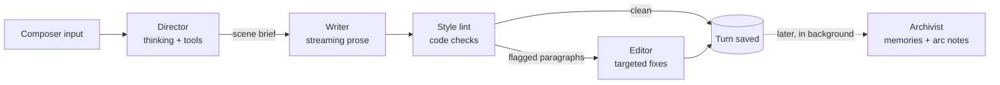

# Bureau — Design Doc

- **Status:** Draft, experimental
- **Started:** 2026-09-11 (last updated 2026-09-12)
- **Working name:** Bureau (not final)
- **Branch:** `feature/bureau`
- **Discussion:** [#49 Chat Mode + Memories](https://github.com/amiantos/writers-guild/discussions/49)

## Summary

Bureau is a new, separate mode in Writers Guild for writing a connected series of stories with
characters who remember, change, and keep living between stories. Each Bureau is a self-contained
environment: a cast, a world, an ordered set of stories, correspondence between stories, and one
shared clock, **Bureau time**.

Generation is agentic. A **Director** gathers what a scene needs using tools, a **Writer** produces
the prose, an **Editor** enforces house style, and an **Archivist** turns what happened into
memories.

Story mode stays exactly as it is. Bureau imports existing code rather than changing it, and has its
own routes, views, and database file.

## Motivation

In story mode, nothing outlives a story. A story is one text blob, a character card is a fixed
input, and every generation is a single system + user request. Characters start from a blank slate
every time. Returning to a favorite character across many stories starts to feel strange: they never
remember you, never change, and don't exist between stories.

Discussion #49 proposed the missing pieces: a lighter way to talk with characters between stories
("texting while you're busy," as opposed to the "holodeck" of story mode), memory that ties both
together, and time awareness so characters have routines and lives of their own.

Bureau is framed neutrally, in the Writers Guild motif: a tool for living characters and connected
stories. Companion-style use (one main character, your persona, frequent correspondence) is one way
to use a Bureau, not a special case. Nearly every companion feature is an ordinary fiction-writing
idea:

| Companion idea            | Writing term                           |
| ------------------------- | -------------------------------------- |
| Memory                    | Continuity                             |
| Growth over time          | Character arc                          |
| Their life between visits | Offscreen time                         |
| Texting                   | Correspondence (epistolary interludes) |
| Profile plus memories     | Series bible                           |

## Goals

- Characters remember what they experienced, per character, with sources you can inspect.
- Characters develop over time through reviewable changes, without rewriting their original card.
- Stories in a Bureau connect: later stories know what happened in earlier ones.
- Correspondence with cast members between stories, feeding the same memory.
- One Bureau time: correspondence happens in real time, and each story starts at a time you choose.
- Agentic generation with tools, including a character generator.
- Stricter prose discipline, such as one speaker per paragraph.
- Everything the agents did is inspectable, without cluttering the story.

## Non-goals (for now)

- Changing story mode. It keeps working exactly as it does today.
- Multiple LLM providers. Bureau targets DeepSeek V4.1 Flash only at first.
- Importing or backfilling memories from existing stories. Memory starts empty.
- Vector embeddings. Start with SQLite full-text search.
- Manuscript features such as outlining or export.

## Ground rules

1. **Separate mode.** Bureau code lives in its own namespaced files. Changes to existing files are
   additive and minimal (see [Touch points in existing code](#touch-points-in-existing-code)).
2. **Reuse by import.** Existing services are imported and used as-is, not refactored for Bureau.
   Where Bureau needs a variant of existing logic (for example the preview renderer inside
   `StoryEditor.vue`), it gets its own copy.
3. **Library characters are never modified.** A Bureau keeps its own copy of each card (see
   [Cast members are copies](#cast-members-are-copies)).
4. **Separate database file.** Bureau data lives in `data/bureau.db`, so it can be wiped and rebuilt
   during development without touching `writers-guild.db`.

## Concepts

| Concept            | What it is                                                                                   |
| ------------------ | -------------------------------------------------------------------------------------------- |
| **Bureau**         | An environment for a connected series of stories. Holds everything below.                    |
| **Cast**           | The Bureau's characters. Each has a file: seed card, arc notes, memories, routine.           |
| **World**          | Attached lorebooks plus world state: timeline and ongoing threads.                           |
| **Story**          | An ordered sequence of turns, with a start time. Stories within a Bureau are ordered too.    |
| **Turn**           | One group of paragraphs (user prose, a direction, or a generated passage) plus its metadata. |
| **Turn seam**      | A hidden divider between turns that expands to show how the next turn was made.              |
| **Correspondence** | A message thread between the persona and one cast member, between stories.                   |
| **Bureau time**    | The Bureau's current date and time. Correspondence moves it to the present; stories ask.     |
| **House style**    | An editable prose rulebook used by the Writer and the Editor.                                |

### Cast members are copies

When a library character joins a Bureau, the Bureau stores its own copy of the card (the **seed
card**). Everything that character develops (memories, arc notes, routine) stays in that Bureau.

- The library card never changes, consistent with Writers Guild's stance that saved characters
  should only change deliberately.
- The same library character can live in two Bureaus with separate histories.
- **Export to library** saves an evolved character as a _new_ library character.

The user's persona is a cast member too. "What a character knows about you" is just one character's
memory of another, so no separate user concept is needed.

## The story view: turns

Bureau stories use a reading view modeled on story mode's preview (`showPreview` in
`StoryEditor.vue`): rendered prose with inline images and an input bar at the bottom, instead of one
large textarea.

The trade-off: you lose typing anywhere in the canvas, but a story becomes an ordered list of
**turns** instead of one text blob. That enables:

- **Turn seams.** Everything that went into a turn, hidden until you ask for it (see
  [Turn seams](#turn-seams)).
- **Turn actions.** Edit in place, regenerate, delete, and choose between variants.
- **Precise memory sources.** Memories point at the turns they came from.
- **Incremental memory.** The Archivist processes turns since its last pass instead of rereading the
  whole story.

### Turn kinds

| Kind                   | Shown as                         | Sent to the Writer as          |
| ---------------------- | -------------------------------- | ------------------------------ |
| `prose` (user-written) | Prose, attributed to the persona | Story text                     |
| `prose` (generated)    | Prose                            | Story text                     |
| `direction`            | A small, collapsible note        | Instructions for the next beat |
| `scene_break`          | A divider                        | A marker in the story text     |

Turns never move Bureau time. Time passing inside a story is written as prose, as in any book
("Three hours later…").

### Turn seams

Between every pair of turns is an invisible seam. Hovering reveals a thin divider, and clicking it
expands in place to show how the turn below it was made:

- Which cast member led the turn
- The Director's reasoning, each tool call with its result, and the scene brief
- The Writer's reasoning, if thinking was on
- Style lint flags and each Editor fix, with the original text and a revert button
- Model, tokens, and timing for every step
- Later: what the Archivist took from the turn (memories added, arc notes proposed)

Collapsed, the story reads like a story. Expanded, it reads like an agent transcript. Everything
stays in one interface, and no separate screen is needed to see how a turn was made.

- **While a turn is generating,** its seam stays open with a one-line live status (for example
  "Recalling: the lighthouse"), which can be expanded to follow each step as it happens. It collapses
  when the turn is done.
- **Touch screens have no hover,** so on touch devices seams show as a faint marker you can tap.
- **User-written turns** have seams too, showing only when they were written and whether they've
  been edited.

### Composer

A multi-line textarea at the bottom (story mode's preview bar is a single-line input), with these
actions:

- **Write:** add the text as a prose turn, then generate a response (like story mode's preview bar).
- **Direct:** add a direction turn, for example "she suggests the night market," then generate.
- **Continue:** generate with no new input.
- **Continue as…:** choose which cast member leads the next turn (like story mode's character
  button).

Editing a turn opens a textarea for just that turn, which recovers most of the feel of editing
directly.

### Rendering

Bureau ports story mode's preview pipeline into its own composable instead of extracting it from
`StoryEditor.vue`: pull out `` tags, escape HTML, convert markdown images using the shared
patterns in `shared/regex-patterns.js`, split paragraphs, restore images, and sanitize with
DOMPurify. Rendering is per turn, so streaming only re-renders the active turn.

### Prose stays prose

Turns are storage and UI structure. The Writer still reads the story as continuous prose, never as a
chat transcript. Writers Guild's core bet, that novel-style context produces better writing than chat
formatting, still holds.

## Generation pipeline

A generated turn passes through up to four roles. All use DeepSeek V4.1 Flash with different prompts
and settings.



**Why split the roles:** Writers Guild exists because chat formatting made models worse
storytellers, and a tool-calling transcript likely does the same to prose. Splitting keeps the
Writer's prompt clean, keeps streaming simple, and lets each role be tuned on its own. This is a
hypothesis. Because every run is recorded, it should be cheap to A/B against a single agent that
calls tools and writes in one conversation.

**Fast path:** a plain Continue with nothing new to look up can skip the Director (or run it without
thinking) to keep latency down.

### Director

Reads a compact view of the Bureau (cast files, recent turns, composer input) and uses tools to
gather what the next turn needs.

| Tool                            | Purpose                                                                        |
| ------------------------------- | ------------------------------------------------------------------------------ |
| `recall(query, character?)`     | Full-text search over a character's memories and the turns they witnessed      |
| `lookup_lore(query)`            | Search attached lorebooks beyond what keyword activation already selected      |
| `get_character_file(id)`        | The full file for one cast member                                              |
| `create_character(role, notes)` | Generate a draft cast member (see [Character generator](#character-generator)) |

Output is a **scene brief**, returned through a strict schema: beats, cast present, point of view,
relevant memory ids (each with a one-line reason), tone, target length, and notes for the Writer.

### Writer

Builds the prompt from the most stable parts to the most volatile, to make the most of DeepSeek's
context caching:

1. House style and perspective rules
2. Cast: seed cards plus accepted arc notes
3. World: lorebook entries (selected by `LorebookActivator` over recent turns) and world state
4. Always-on memories plus the memories named in the brief
5. Short summaries of earlier stories in the Bureau, then this story's prose so far (oldest turns
   truncated first)
6. The scene brief and composer input, plus, for a story's opening turn only, a loose description of
   its start time (see [Time in prompts](#time-in-prompts))

Output streams into the active turn. Images pass through `ImagePreserver` exactly as in story mode.

### Style lint and Editor

`style-lint.js` is a set of pure, unit-tested checks:

- **Multiple speakers in one paragraph:** find quoted dialogue, attribute speakers from dialogue tags
  and names, and flag paragraphs with two or more speakers.
- **Perspective and tense drift:** first-person or present-tense narration outside quotes, when the
  Bureau uses third-person past.
- **Asterisk actions.**
- **Repeated phrasing:** n-grams repeated from recent turns, plus a per-Bureau list of banned phrases.
- **Writing for the persona** (optional): dialogue or actions attributed to the persona in a
  generated turn.

The Editor receives only the flagged paragraphs, the reasons they were flagged, and the house style.
It returns strict JSON: a list of `{ paragraph, replacement, rule }` edits. Fixes apply automatically;
the turn's seam shows the original text and each fix, so reverting a bad edit takes one click.

### Archivist

**When it runs:** when a story ends, when turns have settled (enough newer turns exist, or the story
has been idle for a while), when a correspondence session goes quiet, or on demand ("Commit to
memory").

**Input:** unprocessed turns or messages, who was present, and each present character's current
file.

**Output:** a strict-schema list of operations:

- `add_memory`, `update_memory` (supersedes an older memory), `retire_memory`
- `add_episode`: a dated summary of the story or session, per present character
- `propose_arc_note`: character development, which waits for approval
- `update_world`: ongoing threads and timeline events

Memory operations apply automatically because they are visible, sourced, and reversible. Arc notes
wait for review. Editing or deleting a turn that memories cite marks those memories for review.

### API key and model

Each Bureau has its own DeepSeek API key and model, set in the Bureau's settings and stored in
`bureau.db`. Bureau never reads story mode's presets. Separate keys also let people keep billing
separate per Bureau. The UI shows keys masked, and the API never returns a stored key in full.

### DeepSeek client

Bureau gets its own `deepseek-client.js`; the existing `deepseek-provider.js` stays untouched.

- Multi-turn `messages`, `tools`, a thinking toggle, and streaming that includes tool-call deltas.
- In thinking mode with tools, `reasoning_content` from earlier turns in the tool loop must be sent
  back to the API.
- Strict function schemas require the `/beta` base URL. Supported schema types: string, number,
  integer, boolean, object, array, enum, and anyOf.
- JSON output mode (`response_format: { type: 'json_object' }`) is available as a fallback.

## Memory

Memory belongs to characters, not to the Bureau.

| Layer          | Contents                                                                                  | In the prompt                                            |
| -------------- | ----------------------------------------------------------------------------------------- | -------------------------------------------------------- |
| Seed card      | Copy of the library card at join time; never rewritten                                    | Always                                                   |
| Arc notes      | Accepted development notes, versioned                                                     | Always                                                   |
| Knowledge      | Facts about other cast members (persona included), preferences, milestones, running jokes | Always, within a budget ranked by importance and recency |
| Episodes       | Dated summaries of stories and correspondence sessions the character took part in         | Recent ones in full                                      |
| Eras           | Summaries rolled up from older episodes                                                   | Always, compact                                          |
| Offscreen life | Routine, plus what the character did while nobody was watching                            | In correspondence and story openings                     |
| Archive        | Raw turns and messages the character witnessed                                            | Only through `recall`                                    |

### Who remembers what

Start simple: cast members in a story remember it, and correspondence is private to its two
participants. Offscreen life belongs to the character who lived it until they share it. Presence is
tracked per story at first; per-turn presence (someone leaving mid-scene) can come later.

A story also only remembers what happened before its start time (see
[Time and memory](#time-and-memory)).

### Sources and review

Every memory links to the turns or messages it came from. Each character has a memory browser:
search, edit, pin, retire, and jump to the source. A wrong memory breaks the illusion faster than no
memory, so memories must be visible and easy to correct.

### Retrieval

SQLite FTS5, which is available in the app's better-sqlite3 build, indexes memories and the archive.
Always-on layers cover most needs, and the Director's `recall` handles the long tail. Embeddings are a
later option if full-text search misses too much (paraphrases, for example). Nothing depends on a
DeepSeek embeddings endpoint; we couldn't confirm one exists.

### Backstory

When a character joins, an optional backstory step lets you write what they already know or share
with other cast members. It's saved as knowledge memories with `backstory` as the source.

## Character development

- The seed card never changes. Accepted arc notes layer on top of it.
- The Archivist proposes arc notes with a rationale and sources. You accept, edit, or reject each
  one, and the history is kept.
- **Why not rewrite the card:** repeated LLM rewrites flatten a character toward bland and agreeable.
  A fixed seed anchors the voice; notes only add.
- **Drift check (later):** periodically compare recent dialogue against the seed card's voice and flag
  drift.
- **Export to library** merges seed card and arc notes into a new library character, never
  overwriting the original.

## Correspondence

- One thread per persona and cast member pair. Short first-person messages (texts by default), with
  their own section of the house style.
- Correspondence is always real time: sending or receiving a message moves Bureau time to the
  Bureau's present (see [The Bureau's present](#the-bureaus-present)).
- Every prompt includes a loose time of day, the character's routine for right now, and recent
  episodes. The time since the last message is included only when the gap is long enough to matter.
- Replies use a lighter pipeline: Writer-style generation with memory, calling the Director only when
  tools are needed.
- Sessions become episodes, so the next story knows you texted that afternoon.
- **Offscreen life** fills the gap whenever Bureau time jumps forward (see
  [Offscreen life](#offscreen-life)).
- **Later:** characters message first, and other delivery channels such as an IRC bridge.

## Bureau time

Each Bureau has a single clock, **Bureau time**: the current date and time in the Bureau. It changes
at only three moments:

| When                          | What happens to Bureau time                                                                                 |
| ----------------------------- | ----------------------------------------------------------------------------------------------------------- |
| A message is sent or received | It moves to the Bureau's present. Correspondence is always real time.                                       |
| A story starts                | You choose: the present, the current Bureau time, or a time you pick. The story keeps it as its start time. |
| A story ends                  | You choose: the present, a time you pick to reflect how long the story lasted, or no change.                |

Both story dialogs default to whatever you chose last time. Turns never move Bureau time.

### The Bureau's present

A Bureau's present is normally today, but it can be set to another date, such as June 1996. It's
stored as a whole-day offset from the real calendar:

- Time of day always follows your real clock, so a message sent at 11pm is still late at night.
- The date shifts by the offset, and the weekday and season follow the shifted date.
- Everywhere this doc says "the present" (correspondence and both story dialogs), it means real time
  plus the offset.
- When the offset isn't zero, the Bureau's year goes into the world section of prompts as setting,
  not as a timestamp, so the Writer avoids anachronisms.
- Correspondence doesn't have to be texting. The house style can set a medium that fits the era,
  such as letters or email.

### Time in prompts

Exact timestamps aren't sent with every generation, because models tend to fixate on them. Instead:

- A story's **opening turn** gets a loose description of its start time, such as "a Tuesday, a little
  past midnight, late October." After that, the story's own prose carries the time.
- **Correspondence** gets a loose time of day with every message, plus the gap since the last message
  when it's long enough to matter.
- Loose descriptions come from a small, unit-tested function in `bureau-time.js`, not from the model,
  so they stay consistent.

### Time and memory

- **A story only remembers what happened before its start time.** Messages exchanged while a story is
  still unfinished don't leak into it, because they come after its start. Starting a story at an
  earlier time works as a flashback: characters don't know what happens later.
- Memories from a story are dated to its start time. Memories from correspondence are dated to when
  the messages were sent.

### Offscreen life

- When Bureau time moves forward across a gap (a message after a quiet stretch, or a story starting
  later than the current Bureau time), one capped call generates what the characters involved did
  during that gap and stores it as offscreen life.
- Moving time forward when a story **ends** doesn't generate offscreen life. That span counts as time
  the story covered.
- Nothing runs in the background: a month away produces one summary, not thirty days of invented
  drama. Prompts ask for mostly mundane events and cap the notable ones.

## Character generator

One service, two ways in:

- **Standalone** (from a Bureau or the library): a seed idea, plus an optional world and cast for
  consistency, produces a full V2 card (name, description, personality, scenario, first message,
  example dialogue, tags) and a structured **appearance block**. You review and edit it, then it saves
  as a new library character through existing storage.
- **Director tool:** when a new named character enters a story, `create_character` makes a **draft
  cast member** that exists only in that Bureau. Drafts keep new characters consistent without
  cluttering the library; promote one if you like them.
- **Appearance block:** hair, eyes, build, age range, clothing style, and distinguishing marks,
  stored under the card's `extensions`. It gives portrait generation a stable description to work
  from.
- **Portraits (later):** a pluggable image provider (AI Horde's image API, a local
  ComfyUI/Automatic1111, or a hosted API). Images are stored with `AssetManager` under a `bureaus`
  entity type, served by a Bureau route, and can appear inline in turns.

## Run records

- Every pipeline run and step is recorded: role, messages, tool calls and results, raw output,
  reasoning, tokens, timing, and errors.
- [Turn seams](#turn-seams) are the main way to read a run, right next to the prose it produced.
- **Later, a Workbench screen:** compare runs side by side and rerun a step with an edited prompt.

## Data model

`data/bureau.db` uses better-sqlite3 in WAL mode, with its own schema versioning. References to rows
in `writers-guild.db` (library characters and lorebooks) are plain ids, not foreign keys.

A sketch, not final:

```text
bureaus        (id, name, description, api_key, model, bureau_time, present_offset_days,
                timezone, house_style, settings JSON, created, modified)
cast_members   (id, bureau_id, library_character_id NULL, is_persona, is_draft,
                seed_card JSON, routine JSON, created)
arc_notes      (id, cast_member_id, content, rationale, source_refs JSON,
                status [proposed|accepted|rejected], created, decided)
bureau_lorebooks (bureau_id, lorebook_id)
world_threads  (id, bureau_id, title, summary, status, modified)

stories        (id, bureau_id, position, title, status [active|ended], start_time,
                end_time NULL, created, modified)
story_cast     (story_id, cast_member_id)
turns          (id, story_id, position, kind, source [user|generated], author_cast_id NULL,
                content, run_id NULL, edited, created, modified)
turn_variants  (id, turn_id, content, run_id, created)

threads        (id, bureau_id, cast_member_id, created)
messages       (id, thread_id, sender_cast_id, content, bureau_time, run_id NULL, created)

memories       (id, cast_member_id, layer [knowledge|episode|era|offscreen|backstory],
                content, importance, world_time, source_refs JSON, superseded_by NULL,
                pinned, needs_review, created, modified)
memories_fts   -- FTS5 over memories.content
archive_fts    -- FTS5 over turn and message text

agent_runs     (id, bureau_id, trigger, target_type, target_id, status, started, finished)
agent_steps    (id, run_id, role, request JSON, response JSON, reasoning, tool_calls JSON,
                usage JSON, duration_ms, error)
```

Messages store their Bureau time directly instead of deriving it from `created`, because a Bureau's
present offset can change later.

## Code layout

New code follows the existing layout, namespaced under `bureau`:

```text
server/src/routes/bureaus.js             # /api/bureaus/*
server/src/services/bureau/
  bureau-db.js                           # bureau.db connection and schema
  bureau-storage.js                      # queries
  deepseek-client.js                     # messages, tools, strict schemas, streaming
  pipeline.js                            # Director → Writer → lint → Editor
  director.js
  writer-prompt.js
  style-lint.js
  editor.js
  archivist.js
  memory.js                              # budgets, retrieval, FTS
  bureau-time.js                         # Bureau time changes, loose time descriptions
  offscreen.js
  character-generator.js
  run-recorder.js                        # agent_runs and agent_steps

vue_client/src/views/bureau/             # Bureau list and home, story, correspondence
vue_client/src/components/bureau/        # TurnBlock, TurnSeam, Composer, MemoryBrowser, ...
vue_client/src/composables/bureau/       # turn rendering, streaming, ...
```

Tests are colocated in `__tests__/` as usual. Bureau database tests create temporary directories and
never touch `data/`.

### Reused as-is

- `sqliteStorage.js`: read library characters and lorebooks; save new library characters
- `lorebook-parser.js`, `lorebook-activator.js`
- `macro-processor.js`, `template-engine.js`
- `image-preserver.js`, `shared/regex-patterns.js`
- `asset-manager.js` (with a new `bureaus` entity type), `image-cacher.js`
- `character-parser.js`

### Touch points in existing code

- `server/server.js`: mount `/api/bureaus`.
- `vue_client/src/router/index.js`: add the Bureau routes.
- `vue_client/src/views/LandingPage.vue`: add a Bureaus tab next to Stories, Characters, Lorebooks,
  and Presets.

`server/src/services/database.js` is not touched, because Bureau has its own database.

## Phases

Each phase ends with something usable.

1. **Foundations**
   - `bureau.db` and schema, Bureau CRUD with per-Bureau API key and model, adding cast from the
     library
   - `deepseek-client.js` (messages, tools, strict JSON, streaming, reasoning pass-back)
   - Run recorder
   - _Done when:_ a tool-calling loop against V4.1 Flash runs from a script and every step is
     recorded in `bureau.db`.
2. **Turn-based stories**
   - Story view with turns, rendering, composer, and per-turn edit, regenerate, and variants
   - Turn seams showing each run, including live status during generation
   - Starting and ending stories with the Bureau time dialogs; loose start time in the opening turn
   - Writer-only generation (no Director yet), with house style and lorebooks
   - _Done when:_ writing a Bureau story is comfortable, images included, and every generated
     turn's seam shows how it was made.
3. **Memory**
   - Archivist, memory layers, FTS, memory browser, backstory step, memories in the Writer prompt,
     stories in sequence, stories only remembering what came before their start time
   - _Done when:_ a second story remembers the first, and every memory shows its source.
4. **Director and Editor**
   - Director with tools and scene briefs, style lint, Editor; seams show briefs, recalls, and fixes
   - _Done when:_ multi-speaker paragraphs are caught and fixed, and the split can be compared against
     Writer-only generation using recorded runs.
5. **Character development:** arc note proposals and review; export to library.
6. **Character generator:** standalone flow, `create_character` tool, draft cast members; portraits
   afterward.
7. **Correspondence and offscreen life:** threads, real-time Bureau time updates, the Bureau's
   present offset, offscreen life, episodes from sessions.
8. **Later:** Workbench screen for comparing and rerunning runs, characters message first, IRC
   bridge, learning house style from user edits to generated turns, embeddings, drift check, other
   providers.

## Risks

| Risk                                    | Mitigation                                                                                   |
| --------------------------------------- | -------------------------------------------------------------------------------------------- |
| Characters flatten over time            | Fixed seed card; additive, reviewed arc notes; drift check later                             |
| False or distorted memories             | Sources on every memory; editable; `recall` can check raw text; edited sources flag memories |
| Prompt bloat dilutes attention          | Per-layer budgets, eras, long tail through `recall`                                          |
| Multi-step turns are slow or costly     | Fast path that skips the Director; Editor only on flagged paragraphs; stable prompt prefix   |
| Lint false positives cause bad edits    | Pure, unit-tested checks; every fix visible in its seam with one-click revert                |
| Characters fixate on the time           | No exact timestamps in prompts; loose descriptions only in story openings and correspondence |
| Offscreen life escalates into melodrama | Generated only when Bureau time jumps forward, capped, mostly mundane by instruction         |
| DeepSeek API details change             | All model access goes through one client; run records and seams surface failures             |
| Scope creep                             | Phases that each end usable; experimental label; separate database                           |

## Open questions

1. Final name: is it Bureau?
2. Should direction turns show as notes in the story, or fold into the seam of the turn they
   produced?
3. Should Editor fixes apply automatically with revert (proposed), or wait for approval?
4. When is a turn settled enough for the Archivist?
5. Is per-story presence enough, or is per-turn presence needed early?
6. Whose "now" does correspondence use: the browser's timezone, or a timezone saved on the Bureau
   (needed if characters ever message first)?
7. Should stories support branching, or only per-turn variants?
8. Does the persona keep memories of its own (useful for Bureaus with more than one persona)?
9. Can a Bureau have more than one unfinished story at a time?

## References

- [Discussion #49: Chat Mode + Memories](https://github.com/amiantos/writers-guild/discussions/49)
- DeepSeek API docs: [Tool Calls](https://api-docs.deepseek.com/guides/tool_calls/),
  [Thinking Mode](https://api-docs.deepseek.com/guides/thinking_mode/),
  [Function Calling](https://api-docs.deepseek.com/guides/function_calling),
  [JSON Output](https://api-docs.deepseek.com/guides/json_mode/)
