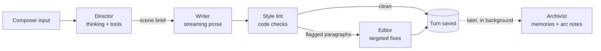

# Bureau — Design Doc

- **Status:** Experimental; phases 1–7 are built
- **Started:** 2026-09-11 (last updated 2026-09-12)
- **Working name:** Bureau (not final)
- **Branch:** built on `feature/bureau`, not yet merged into `main`
- **Discussion:** [#49 Chat Mode + Memories](https://github.com/amiantos/writers-guild/discussions/49)

## Summary

Bureau is a new, separate mode in Writers Guild for writing an ongoing story in chapters, with
characters who remember, change, and keep living between chapters. Each Bureau is a self-contained
environment: a cast, a world, an ordered set of chapters, correspondence between chapters, and one
shared clock, **Bureau time**.

Generation is agentic. A **Director** gathers what a scene needs using tools, a **Writer** produces
the prose, an **Editor** enforces house style, and an **Archivist** turns what happened into
memories.

Story mode stays exactly as it is. Bureau imports existing code rather than changing it, and has its
own routes, views, and database file.

## Motivation

In story mode, nothing outlives a story. A story is one text blob, a character card is a fixed
input, and every generation is a single system + user request. Characters start from a blank slate
every time. Returning to a favorite character across many stories starts to feel strange: they never
remember you, never change, and don't exist between stories.

Discussion #49 proposed the missing pieces: a lighter way to talk with characters between stories
("texting while you're busy," as opposed to the "holodeck" of story mode), memory that ties both
together, and time awareness so characters have routines and lives of their own.

Bureau is framed neutrally, in the Writers Guild motif: a tool for living characters and an ongoing
story. Companion-style use (one main character, your persona, frequent correspondence) is one way
to use a Bureau, not a special case. Nearly every companion feature is an ordinary fiction-writing
idea:

| Companion idea            | Writing term                           |
| ------------------------- | -------------------------------------- |
| Memory                    | Continuity                             |
| Growth over time          | Character arc                          |
| Their life between visits | Offscreen time                         |
| Texting                   | Correspondence (epistolary interludes) |
| Profile plus memories     | Series bible                           |

## Goals

- Characters remember what they experienced, per character, with sources you can inspect.
- Characters develop over time through reviewable changes, without rewriting their original card.
- Chapters in a Bureau connect: later chapters know what happened in earlier ones.
- Correspondence with cast members between chapters, feeding the same memory.
- One Bureau time: correspondence happens in real time, and each chapter starts at a time you
  choose.
- Agentic generation with tools, including a character generator.
- Stricter prose discipline, such as one speaker per paragraph.
- Everything the agents did is inspectable, without cluttering the story.

## Non-goals (for now)

- Changing story mode. It keeps working exactly as it does today.
- Multiple LLM providers. Bureau targets DeepSeek V4.1 Flash only at first.
- Importing or backfilling memories from existing stories. Memory starts empty.
- Vector embeddings. Start with SQLite full-text search.
- Manuscript features such as outlining or export.

## Ground rules

1. **Separate mode.** Bureau code lives in its own namespaced files. Changes to existing files are
   additive and minimal (see [Touch points in existing code](#touch-points-in-existing-code)).
2. **Reuse by import.** Existing services are imported and used as-is, not refactored for Bureau.
   Where Bureau needs a variant of existing logic (for example the preview renderer inside
   `StoryEditor.vue`), it gets its own copy.
3. **Library characters are never modified.** A Bureau keeps its own copy of each card (see
   [Cast members are copies](#cast-members-are-copies)).
4. **Separate database file.** Bureau data lives in `data/bureau.db`, so it can be wiped and rebuilt
   during development without touching `writers-guild.db`.

## Concepts

| Concept            | What it is                                                                                   |
| ------------------ | -------------------------------------------------------------------------------------------- |
| **Bureau**         | An environment for an ongoing story, written in chapters. Holds everything below.            |
| **Cast**           | The Bureau's characters. Each has a file: seed card, arc notes, memories, routine.           |
| **World**          | Attached lorebooks plus world state: timeline and ongoing threads.                           |
| **Chapter**        | An ordered sequence of turns, with a title, start time, and cast. Chapters are ordered too.  |
| **Turn**           | One group of paragraphs (user prose, a direction, or a generated passage) plus its metadata. |
| **Turn seam**      | A hidden divider between turns that expands to show how the next turn was made.              |
| **Correspondence** | A message thread between the persona and one cast member, between chapters.                  |
| **Bureau time**    | The Bureau's current date and time. Correspondence moves it to the present; chapters ask.    |
| **House style**    | An editable prose rulebook used by the Writer and the Editor. Empty follows the default.     |

Code, the API, and the database still call a chapter a `story`: the `stories` and `story_cast`
tables, routes under `/stories`, and the memory source type `story`.

### Cast members are copies

When a library character joins a Bureau, the Bureau stores its own copy of the card (the **seed
card**). Everything that character develops (memories, arc notes, routine) stays in that Bureau.

- The library card never changes, consistent with Writers Guild's stance that saved characters
  should only change deliberately.
- The same library character can live in two Bureaus with separate histories.
- **Export to library** saves an evolved character as a _new_ library character.

The user's persona is a cast member too. "What a character knows about you" is just one character's
memory of another, so no separate user concept is needed.

## The chapter view: turns

Bureau chapters use a reading view modeled on story mode's preview (`showPreview` in
`StoryEditor.vue`): rendered prose with inline images and an input bar at the bottom, instead of one
large textarea.

The trade-off: you lose typing anywhere in the canvas, but a chapter becomes an ordered list of
**turns** instead of one text blob. That enables:

- **Turn seams.** Everything that went into a turn, hidden until you ask for it (see
  [Turn seams](#turn-seams)).
- **Turn actions.** Edit in place, regenerate, delete, and choose between variants.
- **Precise memory sources.** Memories point at the turns they came from.
- **Incremental memory.** The Archivist processes turns since its last pass instead of rereading the
  whole chapter.

### Turn kinds

| Kind                   | Shown as                         | Sent to the Writer as          |
| ---------------------- | -------------------------------- | ------------------------------ |
| `prose` (user-written) | Prose, attributed to the persona | Story text                     |
| `prose` (generated)    | Prose                            | Story text                     |
| `direction`            | A small, collapsible note        | Instructions for the next beat |
| `scene_break`          | A divider                        | A marker in the story text     |

Turns never move Bureau time. Time passing inside a chapter is written as prose, as in any book
("Three hours later…").

### Turn seams

Between every pair of turns is an invisible seam. Hovering reveals a thin divider, and clicking it
expands in place to show how the turn below it was made:

- Which cast member led the turn
- The Director's reasoning, each tool call with its result, and the scene brief
- The Writer's reasoning, if thinking was on
- Style lint flags and each Editor fix, with the original text and a revert button
- Model, tokens, and timing for every step
- Later: what the Archivist took from the turn (memories added, arc notes proposed)

Collapsed, a chapter reads like a book. Expanded, it reads like an agent transcript. Everything
stays in one interface, and no separate screen is needed to see how a turn was made.

- **While a turn is generating,** its seam stays visible with a one-line live status (for example
  "Recalling: the lighthouse"). Clicking it shows the reasoning as it streams. It collapses when the
  turn is done.
- **Touch screens have no hover,** so on touch devices seams show as a faint marker you can tap.
- **User-written turns** have seams too, showing only when they were written and whether they've
  been edited.

### Composer

A multi-line textarea at the bottom (story mode's preview bar is a single-line input), with these
actions:

- **Write:** add the text as a prose turn, then continue the story from it (like story mode's
  preview bar). Who wrote the latest passage doesn't change the instructions.
  Ctrl or ⌘ + Enter also writes.
- **Direct:** add a direction turn, for example "she suggests the night market," then generate. The
  Director and Writer treat a direction as something that hasn't happened yet and write it happening,
  including anything it has the reader's character say or do, and nothing more of theirs.
- **Continue:** generate with no new input.
- **Focus:** choose which cast member the next passage centers on, for any of the three actions
  (like story mode's character button). "Whoever fits" leaves it to the Writer.
- **Scene break** adds a divider without generating, and **Stop** ends a generation early while
  keeping whatever was already written.

Editing a turn opens a textarea for just that turn, which recovers most of the feel of editing
directly.

### Rendering

Bureau ports story mode's preview pipeline into its own composable instead of extracting it from
`StoryEditor.vue`: pull out `` tags, escape HTML, convert markdown images using the shared
patterns in `shared/regex-patterns.js`, split paragraphs, restore images, and sanitize with
DOMPurify. Rendering is per turn, so streaming only re-renders the active turn.

### Prose stays prose

Turns are storage and UI structure. The Writer still reads the story as continuous prose, never as a
chat transcript. Writers Guild's core bet, that novel-style context produces better writing than chat
formatting, still holds.

## Generation pipeline

A generated turn passes through up to four roles. All use DeepSeek V4.1 Flash with different prompts
and settings.



**Why split the roles:** Writers Guild exists because chat formatting made models worse
storytellers, and a tool-calling transcript likely does the same to prose. Splitting keeps the
Writer's prompt clean, keeps streaming simple, and lets each role be tuned on its own. This is a
hypothesis. Because every run is recorded, it should be cheap to A/B against a single agent that
calls tools and writes in one conversation.

**Fast path:** a plain Continue skips the Director by default, to keep latency down. The Director and
Editor only improve a turn: if the Director fails or answers without a brief, the Writer writes
without one, and if the Editor fails, the unedited text stands.

### Director

Reads a compact view of the Bureau (cast files, recent turns, composer input) and uses tools to
gather what the next turn needs.

| Tool                                  | Purpose                                                                                                    |
| ------------------------------------- | ---------------------------------------------------------------------------------------------------------- |
| `recall(query, character)`            | Full-text search over what the characters remember, as of the chapter's start                              |
| `lookup_lore(query)`                  | Search attached lorebooks beyond what keyword activation already selected                                  |
| `get_character_file(name)`            | The full card for one cast member, with their knowledge and recent episodes                                |
| `submit_brief(...)`                   | Hand the Writer the scene brief, which ends the Director's turn                                            |
| `create_character(name, role, notes)` | Generate a draft cast member and add them to the chapter (see [Character generator](#character-generator)) |

Output is a **scene brief**, returned through `submit_brief`'s strict schema: beats, point of view
(whose view only: the house style sets the narration's person and tense, so any narrative person a
brief names, such as "first person" or "close third", is dropped),
tone, target length, memories (only ones the Director found and the passage depends on, each with a
one-line reason; usually none), and notes on continuity the Writer could get wrong. Beats say plainly
what happens and leave dialogue and wording to the Writer. The brief doesn't restate the cards or
plan callbacks to earlier events unless the scene is about them: memories are background, and
characters who keep bringing up the past read as talky and artificial. Beats also don't repeat an
action or bit of business the recent passages already have unless something new comes of it, and
notes leave out props the passage doesn't need. The Director runs with
thinking on at low effort by default and gets four lookups per passage, after which it's told to
hand over its brief. Creating a character isn't a lookup; it has its own limit of two per passage. A successful `submit_brief` call
ends the tool loop without another model call. `recall` only finds what the chapter can see:
memories from before its start, and this chapter's memories from passages before the one being
written.
Searching the raw turns a character witnessed is a later addition. When the reader brings in someone
new by name, `create_character` generates them as a draft cast member before the brief is written.

### Writer

Builds the prompt from the most stable parts to the most volatile, to make the most of DeepSeek's
context caching:

1. House style and perspective rules
2. Cast: seed cards plus accepted arc notes
3. World: lorebook entries (selected by `LorebookActivator` over recent turns) and world state
4. Always-on memories (memories the brief names travel with the brief, in step 6)
5. Short summaries of earlier chapters in the Bureau, then this chapter's prose so far (oldest turns
   truncated first)
6. The scene brief and composer input, plus, for a chapter's opening turn only, a loose description
   of its start time (see [Time in prompts](#time-in-prompts))

Output streams into the active turn. Images pass through `ImagePreserver` exactly as in story mode.

### Style lint and Editor

`style-lint.js` is a set of pure, unit-tested checks. They run on every generated passage and are
recorded in its run even with the Editor off, so Writer-only runs can be compared:

- **Multiple speakers in one paragraph:** attribute each quote from a dialogue tag ("Mara said",
  "said Mara", "Mara turned to Theo and asked,") or, failing that, from an action beat just before
  it that starts with a cast member's name and mentions no one else in the cast, and flag
  paragraphs with two or more speakers. A tag before a quote needs its speaker to start the
  sentence, so the person spoken to isn't mistaken for the speaker, and a capitalized word outside
  the cast counts as a name only if it also appears mid-sentence ("Finally" doesn't).
- **Pronouns:** a "he said" or "she said" counts as someone new only when no named speaker could be
  them. It's then taken for the one cast member who uses that pronoun (inferred from seed cards),
  if they're named in this paragraph or the one before.
- **First-person narration:** three or more of "I", "me", "my", or "myself" outside dialogue and
  thoughts ("…, she thought") when the house style asks for third person.
- **Speaking for the reader's character:** on Write turns, dialogue attributed to the persona.
- **Repeated phrasing:** seven-word stretches of narration repeated from the last three generated
  turns or earlier in the passage, plus a per-Bureau list of banned phrases.

The checks would rather miss a problem than invent one. Paragraphs with images are skipped, and the
Writer's output already has asterisks stripped. Tense drift is left for later, since present-tense
checks are noisy.

The Editor receives the numbered passage, the flagged paragraphs with the reasons they were flagged,
and the house style. It answers with a forced, strict `edit_paragraphs` call: a list of
`{ paragraph, replacement }` edits, applied only to flagged paragraphs. Fixes apply automatically;
the turn's seam shows each fix's before and after, and one click reverts it. A fix reverts only once
(when its original text is back, it's done), and only where its replacement stands as whole
paragraphs.

### Archivist

**When it runs:** on demand ("Commit to memory"), when a chapter ends, and in the background once
turns have settled. A turn is settled when six newer turns follow it; after each generated turn, a
pass starts if at least six settled prose turns are waiting. A Bureau can turn automatic archiving
off, and then the Archivist runs only on demand. Threads are read the same way, one session of
messages at a time: in the background once a session is over (a newer one started, or three hours
passed), from "Commit to memory" in the thread, and for a chapter's cast before the chapter starts.

**Input:** the turns it hasn't read, in passes of about 60,000 characters; the chapter's running
summary; who was present; and what each present character already knows, as numbered memories.
Direction turns are left out.

**Output:** one forced call to a strict `record_memories` tool, with thinking off:

- `knowledge`: facts per character, each with an importance, the passages it came from, and the
  number of any memory it `supersedes`
- `episodes`: one per character, rewritten each pass to tell the whole chapter so far from their
  point of view, in the third person
- `story_summary`: the whole chapter so far, shown in the Bureau's chapter list

A thread's memories are dated to the start of their session and cite its messages, and each session
gets its own episode, rewritten if the session grows.

Memory operations apply automatically because they are visible, sourced, and reversible. The
Archivist can supersede memories but can't retire or delete them, and it leaves alone pinned
memories and any you change while it's reading. Changing a turn it has read (editing, deleting,
switching versions, or regenerating) marks the memories that cite the turn for review, including
episodes, which cite every passage they cover. A turn that changes while a pass is reading it is
flagged the same way. Deleting a chapter deletes its memories, which brings back anything they had
replaced.

**Later:** `propose_arc_note` for character development, which waits for approval (phase 5), and
`update_world` for ongoing threads and timeline events.

### API key and model

Each Bureau has its own DeepSeek API key and model, set in the Bureau's settings and stored in
`bureau.db`. Bureau never reads story mode's presets. Separate keys also let people keep billing
separate per Bureau. The UI shows keys masked, and the API never returns a stored key in full.

### DeepSeek client

Bureau gets its own `deepseek-client.js`; the existing `deepseek-provider.js` stays untouched. It
handles multi-turn `messages`, `tools`, a thinking toggle, and streaming that assembles tool-call
deltas. `tool-loop.js` runs tool calls on top of it, and `run-recorder.js` stores every step.

API details it relies on (checked against api-docs.deepseek.com on 2026-09-12):

- V4.1 Flash's model ID is `deepseek-flash`, the default model for new Bureaus.
- Thinking is on unless a request turns it off, so the client always sends `thinking` explicitly.
  `reasoning_effort` (`low`, `high`, or `max`) is a top-level field.
- Thinking mode rejects `tool_choice: "required"` and named tool choices.
- When a request includes tools, every earlier assistant message must keep its
  `reasoning_content`, even turns without tool calls, or the API returns 400.
- Strict function schemas require the `/beta` base URL, `strict: true` on every function, every
  object property marked required, and `additionalProperties: false`. The client checks schemas
  before sending them.
- JSON output mode (`response_format: { type: 'json_object' }`) is available as a fallback.
- Streams can include `: keep-alive` comment lines, which the parser skips.

## Memory

Memory belongs to characters, not to the Bureau.

| Layer          | Contents                                                                                  | In the prompt                                            |
| -------------- | ----------------------------------------------------------------------------------------- | -------------------------------------------------------- |
| Seed card      | Copy of the library card at join time; never rewritten                                    | Always                                                   |
| Arc notes      | Accepted development notes, versioned                                                     | Always                                                   |
| Knowledge      | Facts about other cast members (persona included), preferences, milestones, running jokes | Always, within a budget ranked by importance and recency |
| Episodes       | Dated summaries of chapters and correspondence sessions the character took part in        | Recent ones in full                                      |
| Eras           | Summaries rolled up from older episodes                                                   | Always, compact                                          |
| Offscreen life | Routine, plus what the character did while nobody was watching                            | The latest account, until an episode comes after it      |
| Archive        | Raw turns and messages the character witnessed                                            | Only through `recall`                                    |

### Who remembers what

Start simple: cast members in a chapter remember it, and correspondence is private to its two
participants. Offscreen life belongs to the character who lived it until they share it. Presence is
tracked per chapter at first; per-turn presence (someone leaving mid-scene) can come later.

The reader's character keeps no memories: the reader remembers for them. A Bureau has one reader's
character, so this never leaves a second persona without a memory.

Phase 3 built seed cards, knowledge, and episodes. In the Writer prompt, each character gets their
pinned knowledge, then the most important knowledge that fits a budget (4,000 characters by default),
and their last three episodes from earlier chapters. Both limits are Bureau settings.

A chapter also only remembers what happened before its start time (see
[Time and memory](#time-and-memory)).

### Sources and review

Every memory links to the turns or messages it came from. Each character has a memory browser:
search, edit, pin, retire, and jump to the source. A wrong memory breaks the illusion faster than no
memory, so memories must be visible and easy to correct. Retired memories, and memories replaced by
newer versions, stay in the browser and can be restored. Restoring a replaced memory retires the
newest version that replaced it, so only one version is current.

### Retrieval

SQLite FTS5, which is available in the app's better-sqlite3 build, indexes memories and the archive.
Always-on layers cover most needs, and the Director's `recall` handles the long tail. Embeddings are a
later option if full-text search misses too much (paraphrases, for example). Nothing depends on a
DeepSeek embeddings endpoint; we couldn't confirm one exists.

### Backstory

A character's memory browser also takes backstory: what they already know or share with other cast
members. It's saved as knowledge with no chapter and no time, so every chapter can see it.

## Character development

- The seed card never changes. Accepted arc notes layer on top of it.
- The Archivist proposes arc notes during its usual pass, with a rationale and the passages that show
  the change, and only when a chapter changes who a character is: a new habit, a stance that
  softened or hardened, a lasting decision. It skips changes the character already has, that are
  already waiting, or that you rejected. Proposals never apply on their own.
- You accept, edit then accept, or reject each one in the character's memory browser ("How they've
  changed"), and can write one yourself, which is accepted as written. Rejected notes stay as
  history, and an accepted note that was edited shows what was first proposed.
- Accepted notes follow the same timeline rule as memories: a chapter sees notes from before its
  start. The Writer gets them in the character's profile ("How Mara has changed"), and the
  Director's `get_character_file` includes them. Changing a passage a note cites marks the note for
  review.
- **Why not rewrite the card:** repeated LLM rewrites flatten a character toward bland and agreeable.
  A fixed seed anchors the voice; notes only add.
- **Drift check (later):** periodically compare recent dialogue against the seed card's voice and flag
  drift.
- **Export to library** copies the seed card into a new library character, adds the accepted notes to
  its description under "How {name} has changed", keeps the original's portrait, and tags it
  `bureau`. The library character the Bureau copied is never overwritten.

## Correspondence

- One thread per cast member, written with the Bureau's reader's character, so choosing a reader's
  character in the cast is what opens messages.
- Replies are short first-person messages, texts by default. The Bureau's settings have a **message
  style** used in place of the house style; for a Bureau set before phones, it can describe letters
  or telegrams.
- Correspondence is always real time: sending a message and every reply move Bureau time to the
  Bureau's present (see [The Bureau's present](#the-bureaus-present)). Each message keeps the Bureau
  time it was sent at, because the present offset can change later.
- A reply is one streamed call with the character's profile and arc notes, their memories as they
  stand at the present (a chapter that started earlier counts even if it hasn't ended), lore
  activated by recent messages, and the conversation as a labeled transcript, since this is a chat.
  The transcript marks a loose time at its start and after each long gap. The prompt ends with the
  loose time now, and how long it's been since the last message when that matters. Messages in a
  reply are separated by a line holding only `---`, and a reply saves as up to six messages.
- The thread view groups messages into sessions (no gap over three hours), shows how each reply was
  written in a seam, and lets you edit or delete any message; changing one marks memories that cite
  it for review. "Let them write" asks for messages without a new one from you.
- Sessions go into memory the way chapters do (see [Archivist](#archivist)), so the next chapter
  knows you texted that afternoon. Each cast member has a **routine**, written from their cast row,
  which replies take into account for the time of day.
- After a quiet stretch, a reply first gets the character an account of what they did meanwhile (see
  [Offscreen life](#offscreen-life)); the reply's seam shows it as part of the run.
- **Later:** the Director for replies that need tools, characters message first, and other delivery
  channels such as an IRC bridge.

## Bureau time

Each Bureau has a single clock, **Bureau time**: the current date and time in the Bureau. It changes
at only three moments:

| When                          | What happens to Bureau time                                                                                   |
| ----------------------------- | ------------------------------------------------------------------------------------------------------------- |
| A message is sent or received | It moves to the Bureau's present. Correspondence is always real time.                                         |
| A chapter starts              | You choose: the present, the current Bureau time, or a time you pick. The chapter keeps it as its start time. |
| A chapter ends                | You choose: the present, a time you pick to reflect how long the chapter lasted, or no change.                |

Both chapter dialogs default to whatever you chose last time. Turns never move Bureau time.

### The Bureau's present

A Bureau's present is normally today, but it can be set to another date, such as June 1996. It's
stored as a whole-day offset from the real calendar:

- Time of day always follows your real clock, so a message sent at 11pm is still late at night.
- The date shifts by the offset, counted in calendar days in the Bureau's time zone (so a daylight
  saving change between the two dates doesn't move the hour), and the weekday and season follow the
  shifted date.
- Everywhere this doc says "the present" (correspondence and both chapter dialogs), it means real
  time plus the offset.
- When the offset isn't zero, or a chapter starts in a year other than the real one, the year goes
  into the world section of prompts as setting ("The year is 1996."), not as a timestamp, so the
  Writer avoids anachronisms.
- Correspondence doesn't have to be texting. The message style can set a medium that fits the era,
  such as letters or email.
- The present is set in the Bureau's settings as a date; clearing it means today.

### Time in prompts

Exact timestamps aren't sent with every generation, because models tend to fixate on them. Instead:

- A chapter's **opening turn** gets a loose description of its start time, such as "a Tuesday, a
  little past midnight, late October." After that, the chapter's own prose carries the time.
- **Correspondence** gets a loose time of day with every message, plus the gap since the last message
  when it's long enough to matter.
- Loose descriptions come from a small, unit-tested function in `bureau-time.js`, not from the model,
  so they stay consistent.

### Time and memory

- **A chapter only remembers what happened before its start time.** Messages exchanged while a
  chapter is still unfinished don't leak into it, because they come after its start. Starting a
  chapter at an earlier time works as a flashback: characters don't know what happens later.
- Memories from a chapter are dated to its start time. Memories from correspondence are dated to the
  start of the session they came from.
- When two chapters start at the same time (say, one ended without moving the clock and the next
  started at Bureau time), the one earlier in the Bureau's order comes first.
- A chapter sees each memory as it stood when the chapter starts. A memory replaced by a later
  chapter still counts in a flashback set before the change.
- A chapter's own memories stay out of its Writer prompt, because its text is already there.

### Offscreen life

- A character is owed an account when at least 12 hours have passed since they were last seen: their
  latest dated memory, their latest message, or the end of a chapter they were in. Anyone in a
  chapter that's still going is left alone, since the chapter is their time. One forced call to a
  strict `record_offscreen` tool writes everyone owed one two to four sentences about how they spent
  the gap, saved as an offscreen memory:
  - Before a chapter starts: its cast, after their unread messages are committed to memory (a
    thread that fails doesn't keep the others out). Accounts are dated just before the chapter's
    start, and if either step fails, the chapter still starts, with a notice.
  - Before a reply: that character, with the account dated just before the current session of
    messages began, so the session's episode takes over from it once recorded. A failure there
    doesn't stop the reply.
- The call sees each character's routine, what they know, recent episodes, how they have changed,
  and their last time away. It leaves out the reader's character, whose doings belong to the reader.
- Moving time forward when a chapter **ends** doesn't generate offscreen life. That span counts as
  time the chapter covered.
- Nothing runs in the background: a month away produces one summary, not thirty days of invented
  drama. Prompts ask for mostly mundane events and cap the notable ones.
- The Writer and reply prompts include the latest account ("Mara lately: ..."), until an episode
  happens after it. The memory browser lists accounts under "What happened", and a Bureau setting
  turns offscreen life off.

## Character generator

One service, two ways in. Both make one forced strict tool call with thinking off, recorded as a run.
The generator sees the Bureau's cast (names and short descriptions) and world (attached lorebooks and
a few entry titles), so a new character fits in without repeating anyone. The card is about the new
character alone: it never names or describes anyone already in the cast, and leaves how they meet
to the chapters.

- **From a Bureau:** "Generate character" in the cast section takes a seed idea and produces a full
  V2 card (name, description, personality, scenario, first message, example dialogue, tags) and a
  structured **appearance block**. You review and edit it, then add it to the cast as a draft, or add
  it and save it to the library at once.
- **Director tool:** when a new named character enters a chapter,
  `create_character(name, role, notes)` generates a **draft cast member** and adds them to the
  chapter's cast. It creates at most two characters per passage, apart from the Director's lookups,
  and can be turned off in the Bureau's settings. Someone already in the Bureau but not in the
  chapter joins it instead of being created again; a failed generation can be retried.
- **Drafts** exist only in their Bureau, so new characters stay consistent without cluttering the
  library. The Director, Writer, and Archivist treat them like anyone else. "Save to library" on a
  draft's cast row saves its card as a new library character (without an image) and links the cast
  member to it.
- **Appearance block:** hair, eyes, build, age range, clothing style, and distinguishing marks,
  stored under the card's `extensions.bureau_appearance`. It gives portrait generation a stable
  description to work from.
- **From the library (later):** the same generator without a Bureau's world, saving straight to the
  library.
- **Portraits (later):** a pluggable image provider (AI Horde's image API, a local
  ComfyUI/Automatic1111, or a hosted API). Images are stored with `AssetManager` under a `bureaus`
  entity type, served by a Bureau route, and can appear inline in turns.

## Run records

- Every pipeline run and step is recorded: role, messages, tool calls and results, raw output,
  reasoning, tokens, timing, and errors.
- [Turn seams](#turn-seams) are the main way to read a run, right next to the prose it produced.
- **Later, a Workbench screen:** compare runs side by side and rerun a step with an edited prompt.

## Data model

`data/bureau.db` uses better-sqlite3 in WAL mode, with its own schema versioning. References to rows
in `writers-guild.db` (library characters and lorebooks) are plain ids, not foreign keys.

A sketch, not final. Phase 1 created `bureaus`, `cast_members`, `agent_runs`, and `agent_steps`;
later phases add the rest as migrations:

```text
bureaus        (id, name, description, api_key, model, bureau_time, present_offset_days,
                timezone, house_style, settings JSON, created, modified)
cast_members   (id, bureau_id, library_character_id NULL, name, is_persona, is_draft,
                seed_card JSON, routine JSON, created, modified)
arc_notes      (id, bureau_id, cast_member_id, content, proposed_content, rationale,
                status [proposed|accepted|rejected], world_time NULL,
                source_type [story|correspondence|manual],
                source_id NULL, source_turn_ids JSON, run_id NULL, needs_review, created,
                decided NULL, modified)
bureau_lorebooks (bureau_id, lorebook_id)
world_threads  (id, bureau_id, title, summary, status, modified)

stories        (id, bureau_id, position, title, status [active|ended], start_time,
                end_time NULL, archived_through, summary, created, modified)
story_cast     (story_id, cast_member_id)
turns          (id, story_id, position, kind, source [user|generated], author_cast_id NULL,
                content, run_id NULL, edited, created, modified)
turn_variants  (id, turn_id, content, run_id, created)

threads        (id, bureau_id, cast_member_id, archived_through, created, modified)
messages       (id, thread_id, position, source [user|generated], sender_cast_id NULL, content,
                bureau_time, run_id NULL, edited, created, modified)

memories       (id, bureau_id, cast_member_id, layer [knowledge|episode|era|offscreen],
                content, importance, world_time NULL,
                source_type [story|correspondence|offscreen|manual],
                source_id NULL, source_turn_ids JSON, run_id NULL, superseded_by NULL,
                pinned, retired, needs_review, created, modified)
memories_fts   -- FTS5 over memories.content
archive_fts    -- FTS5 over turn and message text

agent_runs     (id, bureau_id, purpose, target_type, target_id,
                status [running|completed|failed|cancelled], error, started, finished)
agent_steps    (id, run_id, position, role, kind [model|tool], request JSON, response JSON,
                reasoning, tool_calls JSON, usage JSON, duration_ms, error, created)
```

Messages store their Bureau time directly instead of deriving it from `created`, because a Bureau's
present offset can change later.

## Code layout

New code follows the existing layout, namespaced under `bureau`:

```text
server/src/routes/bureaus.js             # /api/bureaus/*
server/src/services/bureau/
  bureau-db.js                           # bureau.db connection and schema
  bureau-storage.js                      # queries
  deepseek-client.js                     # messages, tools, strict schemas, streaming
  tool-loop.js                           # runs tool calls until the model answers
  writer-turn.js                         # Director → Writer → lint → Editor, one run per turn
  director.js
  writer-prompt.js
  style-lint.js
  editor.js
  archivist.js
  memory-storage.js                      # memory queries and FTS
  memory.js                              # what a story can see, prompt budgets
  bureau-time.js                         # Bureau time changes, loose time descriptions
  thread-storage.js                      # correspondence threads and messages
  correspondence.js                      # replies
  offscreen.js                           # what characters did while time jumped forward
  character-generator.js
  run-recorder.js                        # agent_runs and agent_steps
server/scripts/bureau-smoke.js           # tool-loop smoke test against the real API

vue_client/src/views/bureau/             # Bureau list and home, story, correspondence
vue_client/src/components/bureau/        # TurnBlock, TurnSeam, Composer, MemoryBrowser, ...
vue_client/src/composables/bureau/       # turn rendering, streaming, ...
```

Tests are colocated in `__tests__/` as usual. Bureau database tests create temporary directories and
never touch `data/`.

### Reused as-is

- `sqliteStorage.js`: read library characters and lorebooks; save new library characters
- `lorebook-parser.js`, `lorebook-activator.js`
- `macro-processor.js`, `template-engine.js`
- `image-preserver.js`, `shared/regex-patterns.js`
- `asset-manager.js` (with a new `bureaus` entity type), `image-cacher.js`
- `character-parser.js`

### Touch points in existing code

- `server/server.js`: mount `/api/bureaus`.
- `vue_client/src/router/index.js`: add the Bureau routes.
- `vue_client/src/views/LandingPage.vue`: add a Bureaus tab next to Stories, Characters, Lorebooks,
  and Presets.

`server/src/services/database.js` is not touched, because Bureau has its own database.

## Phases

Each phase ends with something usable.

1. **Foundations**
   - `bureau.db` and schema, Bureau CRUD with per-Bureau API key and model, adding cast from the
     library
   - `deepseek-client.js` (messages, tools, strict JSON, streaming, reasoning pass-back)
   - Run recorder
   - _Done when:_ a tool-calling loop against V4.1 Flash runs from a script and every step is
     recorded in `bureau.db`.
2. **Turn-based chapters**
   - Chapter view with turns, rendering, composer, and per-turn edit, regenerate, and variants
   - Turn seams showing each run, including live status during generation
   - Starting and ending chapters with the Bureau time dialogs; loose start time in the opening turn
   - Writer-only generation (no Director yet), with house style and lorebooks
   - _Done when:_ writing a Bureau chapter is comfortable, images included, and every generated
     turn's seam shows how it was made.
3. **Memory**
   - Archivist, memory layers, FTS, memory browser, backstory step, memories in the Writer prompt,
     chapters in sequence, chapters only remembering what came before their start time
   - _Done when:_ a second chapter remembers the first, and every memory shows its source.
4. **Director and Editor**
   - Director with tools and scene briefs, style lint, Editor; seams show briefs, recalls, and fixes
   - _Done when:_ multi-speaker paragraphs are caught and fixed, and the split can be compared against
     Writer-only generation using recorded runs.
5. **Character development:** arc note proposals and review; export to library.
6. **Character generator:** standalone flow, `create_character` tool, draft cast members; portraits
   afterward.
7. **Correspondence and offscreen life:** threads, real-time Bureau time updates, the Bureau's
   present offset, offscreen life, episodes from sessions.
8. **Later:** Workbench screen for comparing and rerunning runs, characters message first, IRC
   bridge, learning house style from user edits to generated turns, embeddings, drift check, other
   providers.

## Risks

| Risk                                    | Mitigation                                                                                     |
| --------------------------------------- | ---------------------------------------------------------------------------------------------- |
| Characters flatten over time            | Fixed seed card; additive, reviewed arc notes; drift check later                               |
| False or distorted memories             | Sources on every memory; editable; `recall` can check raw text; edited sources flag memories   |
| Prompt bloat dilutes attention          | Per-layer budgets, eras, long tail through `recall`                                            |
| Multi-step turns are slow or costly     | Fast path that skips the Director; Editor only on flagged paragraphs; stable prompt prefix     |
| Lint false positives cause bad edits    | Pure, unit-tested checks; every fix visible in its seam with one-click revert                  |
| Characters fixate on the time           | No exact timestamps in prompts; loose descriptions only in chapter openings and correspondence |
| Offscreen life escalates into melodrama | Generated only when Bureau time jumps forward, capped, mostly mundane by instruction           |
| DeepSeek API details change             | All model access goes through one client; run records and seams surface failures               |
| Scope creep                             | Phases that each end usable; experimental label; separate database                             |

## Open questions

1. Final name: is it Bureau?
2. Should direction turns show as notes in the chapter, or fold into the seam of the turn they
   produced?
3. Should Editor fixes apply automatically with revert (proposed), or wait for approval?
4. When is a turn settled enough for the Archivist? _For now, once six newer turns follow it; revisit
   with use._
5. Is per-chapter presence enough, or is per-turn presence needed early?
6. Whose "now" does correspondence use: the browser's timezone, or a timezone saved on the Bureau
   (needed if characters ever message first)?
7. Should chapters support branching, or only per-turn variants?
8. Does the persona keep memories of its own? _No. A Bureau has one reader's character, and the
   reader remembers for them._
9. Can a Bureau have more than one unfinished chapter at a time?

## References

- [Discussion #49: Chat Mode + Memories](https://github.com/amiantos/writers-guild/discussions/49)
- DeepSeek API docs: [Tool Calls](https://api-docs.deepseek.com/guides/tool_calls/),
  [Thinking Mode](https://api-docs.deepseek.com/guides/thinking_mode/),
  [Function Calling](https://api-docs.deepseek.com/guides/function_calling),
  [JSON Output](https://api-docs.deepseek.com/guides/json_mode/)
